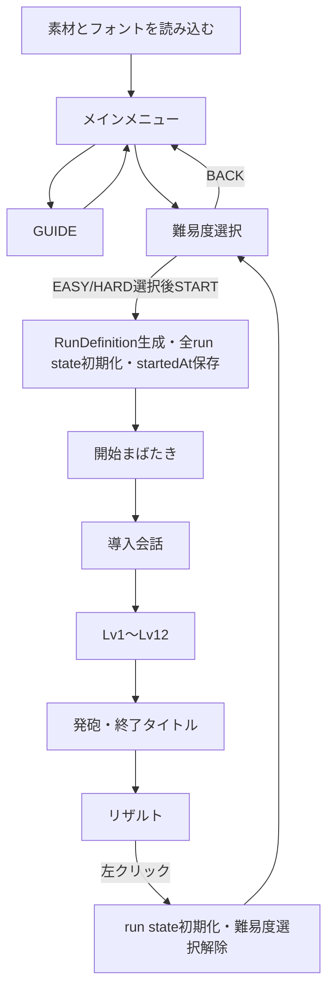

# 完成版仕様・実装役割書

最終更新: 2026-07-21
ステータス: 完成版仕様案・PM承認待ち
最終決定者: `@ly` / PM

## 1. この文書の扱い

この文書は、現行テスト版を完成版へ拡張するための仕様案と実装分担を定義する。PM承認までは、現行の`game-rule.md`、`mende-kikakui-font-guide.md`、`ui-spec.md`、`implementation-spec.md`、`project-flow.md`を正とする。

PM承認後は、本書の内容を既存のメイン資料へ統合してからコード実装を開始する。本書だけを根拠に現行コードの仕様を先行変更しない。

タスク管理は`final-version-task-sheet.md`、非規範の実装例は`final-version-sample-code.md`を参照する。

## 2. 完成版の変更概要

- 起動時にメインメニューを追加する。
- `GUIDE`と、`EASY`／`HARD`を選ぶ難易度選択を追加する。
- ステージ数をLv1〜Lv12へ増やす。
- 語彙を5分類24語へ増やし、暗号に使う文字を連続13字へ固定する。
- `START`ごとに、同じ分類内で暗号と日本語単語の対応をランダムに割り当てる。
- 固定文型と難度条件に従い、例文と問題をプレイごとにランダム生成する。
- 選択肢を全24語から抽選し、Lvとともに4択、6択、8択、10択へ増やす。
- 語頭の分類、英語と同じ語順、意味相性により、未提示の暗号単語を推理可能にする。
- リザルトから直接ゲームを開始せず、未選択状態の難易度選択へ戻す。

ここに記載しない会話表示、手帳、NEW、音、発砲、終了タイトル、Figma照明、人物・机素材、入力抑止は現行仕様を維持する。

## 3. メインメニュー

### 3.1 初期表示

- 必須画像とMendeフォントの読込完了後、メインメニューを表示する。
- 背景は`#020202`の黒地と、Figma node `13:66`由来の`scene-ceiling-light.svg`だけで構成する。
- 人物、机、手帳、ペン、ビネットは表示しない。
- ブラウザ再読込時もメインメニューへ戻す。再読込から導入会話へ自動遷移しない。
- メニュー表示中は開始まばたきを再生しない。

### 3.2 タイトル

- 仮タイトルは疑問符なしの`The Room`とする。
- タイトルは`Cinzel Decorative Bold`を使用する。
- 実装時は`next/font/google`の`Cinzel_Decorative`、weight `700`をタイトル専用CSS変数へ割り当てる。
- タイトル名はPM承認前なら変更可能とし、変更してもメニュー遷移やゲームデータへ影響させない。

### 3.3 メニュー内の表示切替

メインメニューは画面遷移を増やさず、同じ画面内のパネルを切り替える。

| パネル | 表示内容 | 操作 |
| --- | --- | --- |
| ルート | `The Room`、`GUIDE`、`PLAY` | GUIDEまたはPLAYを選ぶ |
| GUIDE | 基本的な遊び方、操作、EASY/HARDの違い、`BACK` | BACKでルートへ戻る |
| 難易度選択 | `EASY`、`HARD`、`START`、`BACK` | 難易度選択後にSTART |

- `START`は難易度未選択中は無効にする。
- `BACK`でルートへ戻った場合は選択済み難易度を保持し、再びPLAYを選んだ時に同じ選択状態を表示する。ゲーム開始またはリザルトからの復帰時には別途初期化する。
- `START`を押した時だけ`RunDefinition`を生成する。生成成功後に全ゲームstateを初期化し、`startedAt`を保存して開始まばたきへ進む。
- メニューの各ボタンは標準の`Tab`と`Enter`で操作でき、`Space`では押下されない。
- メニューとゲーム内のすべての有効なボタンは、マウスまたは`Enter`で押した時に会話送りと同じ`dialogue-next.mp3`を1回鳴らす。無効ボタン、`Space`、ボタン以外の背景クリックではボタン押下音を追加しない。

### 3.4 GUIDEで公開する内容

GUIDEには次だけを表示する。

- 暗号例文と日本語訳を見て、問題の暗号へ日本語を割り当てる目的
- 暗号単語、日本語候補、`解答する`の左クリック操作
- 解答受付中の`Space`による手帳開閉
- 手帳表示中の`A` / `D`によるページ移動
- EASYは制限時間なしで1回まで誤答可能、HARDは制限時間ありで1回の誤答がゲームオーバーになること

次は推理対象なのでGUIDEへ表示しない。

- 語頭と分類の対応
- 暗号文字と日本語の対応
- `数量 → 性質 → 色 → 名詞 → 動詞`の語順
- 名詞種別と意味相性
- 未知語の存在、未知語数、一意解の作り方

## 4. 難易度

### 4.1 難易度設定

| 項目 | EASY | HARD |
| --- | --- | --- |
| 制限時間 | なし | 1問90秒 |
| 時間警告 | なし | 残り15秒 |
| 問題開始時の誤答猶予 | 1 | 0 |
| 1回目の誤答 | 現行の継続可能な誤答 | 即ゲームオーバー |
| 320msの揺れ | 1回目だけ実行 | 実行しない |
| 誤答後の選択 | 保持 | 終了するため再解答なし |
| 正答そのものの表示 | 追加表示しない | 追加表示しない |
| 正答時の1400ms判定 | 実行 | 実行 |
| 時間切れ | 発生しない | 判定なしで即ゲームオーバー |

EASYの1回目の誤答は現行仕様をそのまま使う。

- `正答 n / N`を表示する。
- 正答欄を緑、誤答欄を赤で表示する。
- 選択を保持し、操作とゲーム進行を即座に再開する。
- 問題・解答パネルだけを320ms揺らす。
- 同じ解答を再送信できる。
- 変更した解答欄だけ色分けを解除する。
- 正しい日本語を別欄、候補強調、自動訂正で公開しない。
- 2回目の誤答では判定表示と揺れを挟まずゲームオーバーへ進む。

HARDでは最初の誤答時に`endedAt`を一度だけ保存し、誤答音を1回鳴らしてゲームオーバー演出へ直行する。誤答欄の色分け、`正答 n / N`、320msの揺れは表示しない。

### 4.2 難易度表示

- 導入会話、例文、問題、解答、判定、手帳では左上に`EASY`または`HARD`を表示する。
- メニュー、開始まばたき、発砲、終了タイトル、リザルトでは表示しない。
- 右上ステータスは従来どおり問題単独提示では隠し、`answering`と`answerFeedback`だけ表示する。
- EASYの右上には`間違い可能 n`だけを表示し、タイマー枠を置かない。
- HARDの右上には`残り時間 mm:ss`だけを表示し、誤答猶予を置かない。
- HARDでは手帳表示中もタイマーを進める。

## 5. 暗号と語彙

### 5.1 分類

内部分類を次の5種類へ変更する。

```ts
type WordCategory = "color" | "quality" | "quantity" | "noun" | "verb";
```

現行の`humanNoun`と`animalNoun`は`noun`へ統合し、名詞側の意味属性`nounKind`で区別する。分類名、名詞種別、単語IDはプレイヤー画面へ表示しない。

### 5.2 固定するMende Unicode

ローカルフォントが収録している`U+1E800`〜`U+1E80C`の13字を使う。

| 用途 | コードポイント |
| --- | --- |
| 色の分類文字 | `U+1E800` |
| 性質の分類文字 | `U+1E801` |
| 数量の分類文字 | `U+1E802` |
| 名詞の分類文字 | `U+1E803` |
| 動詞の分類文字 | `U+1E804` |
| 単語1 | `U+1E805` |
| 単語2 | `U+1E806` |
| 単語3 | `U+1E807` |
| 単語4 | `U+1E808` |
| 単語5 | `U+1E809` |
| 単語6 | `U+1E80A` |
| 単語7 | `U+1E80B` |
| 単語8 | `U+1E80C` |

- 1暗号単語の論理コードポイント列は`分類文字 + 単語文字`の2文字固定とする。
- 13文字のコードポイント、分類文字の用途、各分類で使用する単語文字の範囲は固定し、ランダム生成の対象にしない。
- 文全体はLTR、単語内部はRTL、`unicode-bidi: isolate`を維持する。
- 分類文字は単語の読み始め側に見えるよう、既存の`CipherText`の方向制御を使う。
- 現行8文字の割当との互換性は持たせない。完成版開始時に全語を新割当へ一括移行する。
- セーブデータや永続化された手帳は現行版に存在しないため、データ移行処理は設けない。

### 5.3 固定する24語の正本

`WordId`は日本語単語と意味属性を識別する固定IDであり、Mende文字の位置を表す`CipherId`とは分離する。

| WordId | 分類 | 日本語 | 名詞種別 | 許可する名詞種別 |
| --- | --- | --- | --- | --- |
| `color-red` | 色 | 赤い | - | human / animal / object |
| `color-blue` | 色 | 青い | - | human / animal / object |
| `color-black` | 色 | 黒い | - | human / animal / object |
| `color-white` | 色 | 白い | - | human / animal / object |
| `quality-large` | 性質 | 大きな | - | human / animal / object |
| `quality-small` | 性質 | 小さな | - | human / animal / object |
| `quality-old` | 性質 | 古い | - | human / animal / object |
| `quality-broken` | 性質 | 壊れた | - | object |
| `quantity-some` | 数量 | いくつかの | - | human / animal / object |
| `quantity-many` | 数量 | たくさんの | - | human / animal / object |
| `quantity-one-human` | 数量 | ひとりの | - | human |
| `quantity-one-animal` | 数量 | 一匹の | - | animal |
| `noun-man` | 名詞 | 男 | human | - |
| `noun-woman` | 名詞 | 女 | human | - |
| `noun-dog` | 名詞 | 犬 | animal | - |
| `noun-cat` | 名詞 | 猫 | animal | - |
| `noun-bird` | 名詞 | 鳥 | animal | - |
| `noun-fish` | 名詞 | 魚 | animal | - |
| `noun-chair` | 名詞 | 椅子 | object | - |
| `noun-door` | 名詞 | 扉 | object | - |
| `verb-see` | 動詞 | 見る | - | human / animal |
| `verb-chase` | 動詞 | 追う | - | human / animal |
| `verb-sleep` | 動詞 | 眠る | - | human / animal |
| `verb-creak` | 動詞 | 軋む | - | object |

24語の日本語、分類、名詞種別、意味制約は固定し、ランダム生成で追加、削除、言い換えを行わない。

### 5.4 暗号と単語のランダム割当

- `CipherId`はMende文字の位置を表す固定IDとし、`color-1`〜`color-4`、`quality-1`〜`quality-4`、`quantity-1`〜`quantity-4`、`noun-1`〜`noun-8`、`verb-1`〜`verb-4`を使う。
- `START`を押すたび、同じ分類に属する`CipherId[]`と`WordId[]`をseed付きFisher–Yatesでシャッフルし、分類ごとに1対1で対応させる。
- 分類をまたぐ割当は禁止する。色の暗号へ名詞を割り当てるなど、語頭の分類と日本語の品詞が一致しない対応は生成しない。
- 1つの`WordId`を複数の`CipherId`へ割り当てず、1つの`CipherId`へ複数の`WordId`を割り当てない。
- 割当は1プレイの`RunDefinition.wordAssignments`へ保存し、Lv1〜Lv12、手帳、誤答、再描画を通して変更しない。
- リザルトから難易度選択へ戻った後、新たに`START`した時は新しいseedと割当を生成する。
- 同じseedからは同じ割当を再現できるようにし、テストと不具合再現へ使えるようにする。プレイヤー画面へseedは表示しない。
- 暗号のコードポイントと日本語24語は固定であり、ランダム化するのは両者の対応だけとする。

## 6. 語順と意味相性

### 6.1 語順

暗号文と日本語解答のトークン順は、英語と同じ次の順序に固定する。

```text
数量 → 性質 → 色 → 名詞 → 動詞
```

各文型は不要な要素を省略できるが、残った要素の順序を入れ替えない。名詞は必須とし、同じ分類の単語を1文へ複数置かない。

### 6.2 意味相性

各文は名詞を1語持ち、その`nounKind`に対して次をすべて満たす必要がある。

- 色がある場合、色の`allowedNounKinds`に名詞種別が含まれる。
- 性質がある場合、性質の`allowedNounKinds`に名詞種別が含まれる。
- 数量がある場合、数量の`allowedNounKinds`に名詞種別が含まれる。
- 動詞がある場合、動詞の`allowedNounKinds`に名詞種別が含まれる。

例:

| 文 | 判定 | 理由 |
| --- | --- | --- |
| 一匹の 小さな 青い 犬 眠る | OK | 一匹の・眠るはanimalを許可 |
| いくつかの 壊れた 白い 扉 軋む | OK | 壊れた・軋むはobjectを許可 |
| ひとりの 犬 | NG | ひとりのはhumanだけ |
| 壊れた 男 | NG | 壊れたはobjectだけ |
| 椅子 追う | NG | 追うはhuman / animalだけ |
| 猫 軋む | NG | 軋むはobjectだけ |

## 7. Lv1〜Lv12

### 7.1 選択肢数

| レベル | 各トークンの候補数 |
| --- | ---: |
| Lv1〜Lv3 | 4 |
| Lv4〜Lv6 | 6 |
| Lv7〜Lv9 | 8 |
| Lv10〜Lv12 | 10 |

### 7.2 ランダム生成するステージの固定条件

例文と問題に使う日本語単語は各プレイで抽選するが、レベルごとの文型、例文数、未提示語数、候補数は固定する。

| Lv | 例文数 | 例文と問題の文型 | 問題中の未提示語数 | 候補数 |
| ---: | ---: | --- | ---: | ---: |
| 1 | 3 | 色 + 名詞 | 0 | 4 |
| 2 | 2 | 性質 + 名詞 | 1 | 4 |
| 3 | 2 | 数量 + 名詞 | 1 | 4 |
| 4 | 2 | 名詞 + 動詞 | 1 | 6 |
| 5 | 2 | 性質 + 色 + 名詞 | 1 | 6 |
| 6 | 2 | 数量 + 性質 + 名詞 | 1 | 6 |
| 7 | 2 | 色 + 名詞 + 動詞 | 1 | 8 |
| 8 | 2 | 数量 + 名詞 + 動詞 | 1 | 8 |
| 9 | 1 | 性質 + 色 + 名詞 + 動詞 | 1 | 8 |
| 10 | 1 | 数量 + 性質 + 色 + 名詞 | 1 | 10 |
| 11 | 1 | 数量 + 性質 + 名詞 + 動詞 | 1 | 10 |
| 12 | 1 | 数量 + 性質 + 色 + 名詞 + 動詞 | 2 | 10 |

- 各文は固定24語だけで組み立て、6章の語順と意味相性をすべて満たすものだけを採用する。
- 同一プレイ内では、同じ日本語単語列の文を例文または問題として重複使用しない。
- 「未提示語」は、現在レベルの例文提示後にも、過去の例文または正答履歴で暗号と日本語の対応が公開されていない`CipherId`を指す。
- Lv1の問題に含む対応はすべてLv1の3例文から確定できるようにする。
- Lv2〜Lv11は問題へ未提示語を1語、Lv12は2語含める。
- 各レベル確定後も、後続レベルで必要な未提示語数の合計以上の未公開`CipherId`を残す。早いレベルの例文で全対応を公開してはならない。
- Lv12正答時点では固定24語すべての対応が、例文または正答履歴のいずれかで1回以上公開済みになるようにする。
- 未提示語を含む場合も、提示済み対応、分類、語順、意味相性、実際の候補から問題全体の正解が必ず1通りになるものだけを採用する。
- EASYとHARDは同じ生成規則を使い、難易度によって例文、問題、候補数、未提示語数を変えない。

### 7.3 RunDefinitionの生成と固定

- 難易度選択で`START`を押した時に`runSeed`を生成し、暗号と単語の対応、Lv1〜Lv12の例文、問題、候補を含む`RunDefinition`を開始演出前に1回だけ生成する。
- 通常プレイの`runSeed`はブラウザの`crypto.getRandomValues()`から作り、seed付き疑似乱数生成器へ渡す。テスト時は固定seedを注入できるようにする。
- 乱数生成はseedを注入できる純粋関数へ集約し、render中またはコンポーネントの再描画で`Math.random()`を直接呼ばない。
- ステージはLv1から順に生成し、例文で公開する対応と、問題正答後に既知となる対応を追跡して後続レベルの未提示語を決める。
- 生成済みの例文、問題、正解、候補、暗号割当は、トークン切替、手帳開閉、誤答、再描画、レベル開始時に再生成しない。
- 同じ`runSeed`では暗号割当、全例文、全問題、全候補を同じ内容と順序で再現できるようにする。
- ブラウザ再読込ではメインメニューへ戻るため、途中の`RunDefinition`は復元しない。

各レベルについて、意味成立、重複、未提示語数、一意解を満たす組み合わせを最大100回生成する。100回で成立しない場合は次の固定フォールバックへ切り替える。

### 7.4 固定フォールバック

下表は通常出題の固定内容ではなく、ランダム生成失敗時のフォールバックと自動検査用データである。使用時は日本語の`WordId`を、そのプレイの`wordAssignments`で対応する`CipherId`へ変換する。プレイヤーには従来どおり暗号例文と日本語訳を順に提示し、問題では暗号だけを表示する。

| Lv | 例文 | 問題の正解 | 問題中の未提示語 | 候補数 |
| ---: | --- | --- | --- | ---: |
| 1 | 赤い 男<br>青い 男<br>赤い 女 | 青い 女 | なし | 4 |
| 2 | 大きな 犬<br>小さな 猫 | 大きな 鳥 | 鳥 | 4 |
| 3 | いくつかの 男<br>たくさんの 犬 | ひとりの 女 | ひとりの | 4 |
| 4 | 男 見る<br>犬 追う | 猫 眠る | 眠る | 6 |
| 5 | 大きな 赤い 男<br>小さな 青い 犬 | 大きな 黒い 鳥 | 黒い | 6 |
| 6 | いくつかの 大きな 犬<br>たくさんの 小さな 猫 | たくさんの 古い 女 | 古い | 6 |
| 7 | 赤い 男 見る<br>青い 犬 追う | 赤い 魚 見る | 魚 | 8 |
| 8 | いくつかの 鳥 眠る<br>たくさんの 犬 追う | 一匹の 犬 眠る | 一匹の | 8 |
| 9 | 古い 黒い 鳥 眠る | 小さな 白い 猫 眠る | 白い | 8 |
| 10 | 一匹の 小さな 白い 犬 | いくつかの 大きな 黒い 椅子 | 椅子 | 10 |
| 11 | いくつかの 古い 鳥 眠る | たくさんの 古い 椅子 軋む | 軋む | 10 |
| 12 | 一匹の 小さな 青い 犬 眠る | いくつかの 壊れた 白い 扉 軋む | 壊れた、扉 | 10 |

- Lv1は既知語だけの導入問題とする。
- Lv2〜Lv11は問題へ未提示語を1語ずつ入れる。
- Lv12は問題へ未提示語を2語入れる。
- ある問題で正答した未提示語は、正答履歴へ追加された時点で以後の既知語として扱う。
- フォールバックもランダム出題と同じ意味成立、一意解、候補数の検査を通し、不成立ならゲーム開始を止めて開発時エラーを報告する。不正な問題をプレイヤーへ表示しない。

提示例文は合計21件、正答履歴は12件で、全クリア時の手帳履歴は最大33件となる。1見開き6件の現行仕様では最大6見開きになる。

## 8. 候補抽選と一意解

### 8.1 候補生成

- 各暗号トークンごとに候補配列を持つ。
- 候補にはそのトークンの正解を必ず1件含める。
- 残りは、正解以外の全24語から日本語の重複なしで抽選する。
- 正解を含めた配列をシャッフルし、正解位置を固定しない。
- `RunDefinition`の作成時に一度だけ生成して各`Question`へ保存する。
- トークン切替、手帳開閉、再描画、EASYの誤答と再送信では再生成しない。

### 8.2 一意解の条件

候補生成後、次を使って問題全体の成立する割当を列挙する。

- 現在レベルの例文を含む提示済みの暗号・日本語対応。ただし正解検査へ未公開の`wordAssignments`を既知情報として渡さない
- 語頭の分類
- 同じ分類内で異なる暗号IDが同じ日本語を持たないこと
- 固定語順
- 名詞種別と意味相性

成立する問題全体の割当が正解データと同じ1通りだけの場合に採用する。0通りまたは2通り以上なら候補を引き直す。

### 8.3 再生成とフォールバック

- ランダム候補の生成は最大100回まで行う。
- 100回で一意解にならない場合は決定的なフォールバックへ切り替える。
- フォールバックは、正解、既知の同分類語、異なる分類の語の順にマスター語彙表から採用し、未提示の同分類語を正解以外に含めない。
- 必要数を採用後、`runSeed + stageId + tokenIndex`から作るseedで並び替える。
- フォールバック後にも一意解検査を実行し、1通りでなければ開発時エラーとして問題データの修正を要求する。プレイヤーへ不正な問題を表示しない。

## 9. ゲームフローとリトライ



- リザルトの案内は`左クリックで難易度選択へ`とする。
- リザルトをクリックした時点では開始まばたきへ進まない。
- 難易度選択へ戻る時は前回難易度を解除し、`START`を無効にする。
- 新しい難易度を選び`START`を押した時だけ開始まばたきを再生する。
- リザルトから戻る時に会話、Lv、問題、回答、判定、手帳、NEW、時間、回数、終了状態を初期化する。

## 10. 実装インターフェース

完成版では少なくとも次を追加・変更する。

- `Difficulty = "easy" | "hard"`
- `MenuView = "root" | "guide" | "difficulty"`
- `GamePhase`へ`menu`を追加する。
- `InternalCategory`を5分類へ変更し、`NounKind`を追加する。
- `CandidateIndex`を最大8までの`CipherSlotIndex`へ置き換える。
- `CipherId`を5分類24枠の固定暗号位置だけ表せるunionへ変更する。
- 固定日本語語彙の識別子として`WordId`を追加し、`WordEntry`から`cipherId`を分離する。
- `WordEntry`へ`nounKind`または`allowedNounKinds`を持たせる。
- `StageGenerationRule`へ文型、例文数、候補数、未提示語数、フォールバックを持たせる。
- `RunDefinition`へ`runSeed`、分類内の`wordAssignments`、生成済みLv1〜Lv12を持たせる。
- `GeneratedStage`へ生成済みの例文、問題、正解、候補を持たせる。
- seed付き乱数を引数で受け取る暗号割当、ステージ生成、一意解検査を副作用のない関数として実装する。
- `DifficultyConfig`へ時間、警告、誤答猶予を集約する。
- `Question.choiceCandidatesByTokenId`は`RunDefinition`作成時に生成した配列を保持する。
- `MainMenu`はパネル表示とcallbackだけ、`DifficultyBadge`は左上表示だけを担当する。
- EASYで時間を持たないため、右上表示はタイマー専用ではなくモード別ステータスを描画できる責務へ整理する。

具体例は`final-version-sample-code.md`を参照する。

## 11. 担当と編集境界

PM以外の3名全員がコード実装を担当する。PMは仕様承認と最終受入を担当し、実装タスクの主担当にはしない。

| 担当 | 主な実装 | 主な編集範囲 | 編集しない範囲 |
| --- | --- | --- | --- |
| `@ささかまぼこ。` | メニュー、GUIDE、難易度選択、左上表示、10択レスポンシブUI、Figma調整 | メニュー・表示用子コンポーネント、CSS Modules、Figma | `GameScreen`の状態遷移、問題生成 |
| `@かまぼこ(本物)` | メニューstate、開始・リトライ、EASY/HARD分岐、タイマー、終了条件、全体統合 | `GameScreen`、結果遷移、入力の接続 | 暗号Unicode表、語彙の意味データ |
| `@ほっそー` | 共有型、固定13字・24語、分類内ランダム割当、12ステージ生成、意味判定、候補生成、一意解検査 | `src/data`、純粋関数、共有型・設定値 | 表示座標、`GameScreen`の大規模編集 |
| `@ly` | 仕様承認、タイトル確認、最終通しプレイ | PM判定とレビューコメント | コード実装 |

- `GameScreen.tsx`の主編集者は`@かまぼこ(本物)`とする。
- `@ささかまぼこ。`と`@ほっそー`はcallback、型、データの必要変更を先に共有し、`GameScreen`へ並行して大きな変更を入れない。
- 3名とも、自分の実装に対応する動作確認とPRレビューを担当する。

## 12. 完成条件

- 起動と再読込でメインメニューが表示される。
- GUIDEに推理方法が露出しない。
- 難易度未選択ではSTARTできない。
- EASYとHARDの誤答、表示、タイマーが表どおり分岐する。
- リザルトから未選択の難易度選択へ戻る。
- 左上難易度と右上モード別ステータスが指定フェーズだけに表示される。
- 暗号13字と日本語24語は固定され、仮英字と旧暗号割当が完成版画面へ出ない。
- `START`ごとに品詞内の暗号・単語対応が1対1でランダム生成され、1プレイ中は変化しない。
- Lv1〜Lv12の例文と問題が固定文型、例文数、未提示語数、候補数を満たしてランダム生成される。
- 後続レベル用の未提示語が順番どおり残り、Lv12正答時点で24語すべての対応が公開済みになる。
- 同じseedで暗号割当、例文、問題、候補を再現でき、異なるseedでも意味成立と一意解を維持する。
- ランダム候補は重複せず、切替や再描画で変化せず、常に一意解になる。
- NGとなる性質＋名詞、数量＋名詞、名詞＋動詞を問題へ出さない。
- 手帳が最大33件を左3件、右3件の順で6見開きに表示できる。
- 現行のMende方向、手帳操作、音、終了演出、入力抑止に回帰がなく、全有効ボタンで共通の押下音が1回だけ鳴る。
