# プロダクト全体フロー図

最終更新: 2026-07-21
ステータス: 仕様承認済み・実装未完了

## 1. 目的

ゲーム起動からリトライまでの画面状態、会話、例文、手帳、解答、判定、終了演出の関係を定義する。

## 2. 前提

- Next.js App Routerの1ページゲームとし、サーバー処理、DB、移動操作を使わない。
- 主な入力は左クリック、Space、A/D。Tabはゲーム操作に使わない。
- 暗号はMende Kikakuiの実Unicode文字で表示する。
- Lv1からLv8まで進み、各レベルで例文提示、問題提示、解答を行う。
- 各問題の誤答猶予は1回。時間切れは即ゲームオーバーとする。

## 3. 全体フロー

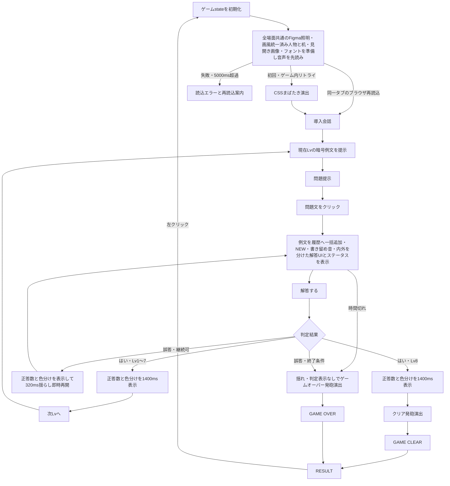

## 4. gamePhase

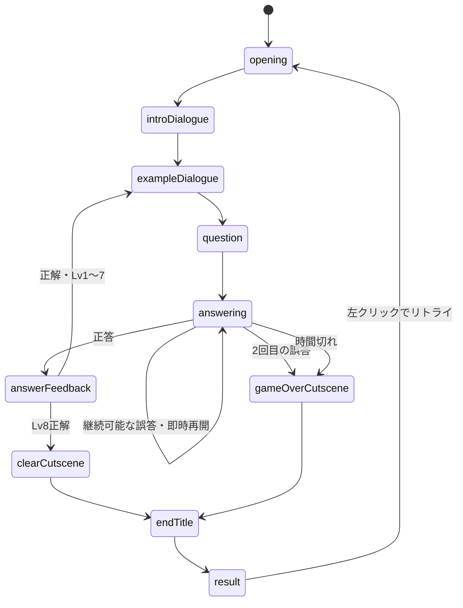

## 5. 開始演出

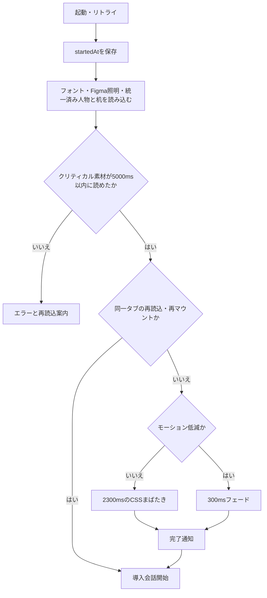

新規タブの初回とゲーム内リトライだけ開始演出を再生する。演出中は会話、手帳、解答を受け付けない。完了は専用`animationend`と+250msのフォールバックを同じ一度きりのガードへ接続する。Figmaは照明と配置の正本、人物・机は`public/assets/images`の現行PNGを画風の正本とし、人物差分切替時に実行時フィルターを加えない。

## 6. 会話表示

| 種類 | 話者 | 色 | 内容 |
| --- | --- | --- | --- |
| 通常 | 地の文 | 白 | 導入、状況説明 |
| 暗号 | 男 | 赤 | 暗号例文、問題文 |
| 日本語訳 | 男 | 青 | 例文の日本語訳 |
| 解答 | プレイヤー | 青 | 判定前の選択済み日本語 |

話者列は発話音を選ぶための内部情報であり、画面にはどの種類でも話者名と`「」`を表示しない。

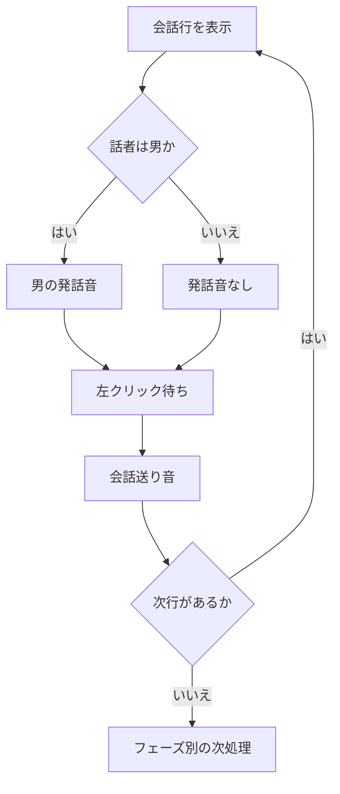

導入会話の本文と順番は`src/data/introDialogues.ts`を正とし、全行を地の文として扱う。

## 7. ラウンド

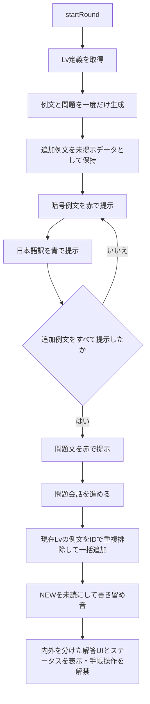

例文会話中と問題単独提示中は手帳を開けず、残り時間と間違い可能回数も表示しない。現在レベルの例文は`answering`へ入るまで履歴に追加しない。

## 8. 手帳とNEW

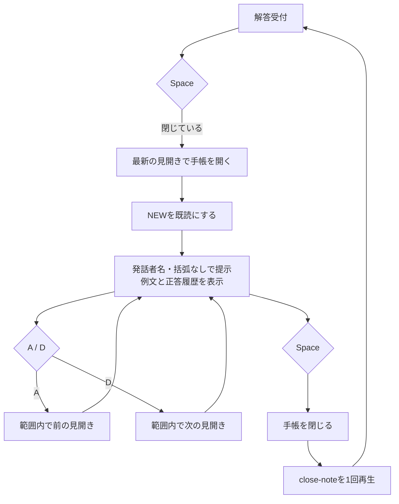

導入、例文、問題提示、判定中のSpaceは手帳操作として処理しない。

- 履歴は時系列順に左3件、右3件を埋めてから次の見開きへ進む。
- 左右ページ枠を見開き画像の紙面中央へ合わせ、各枠内で履歴要素を中央揃えにする。
- 履歴は紙色の半透明背景と読みやすい拡大文字で表示し、3段の位置を保ったまま背景の高さを内容へ合わせる。ページ番号は背景付きの`a/b`として、見開き画像と重ならない範囲で拡大して上側外へ置く。
- 正答時は問題と送信済み解答を発話者名・括弧なしの通常例文と同じ形式で無通知追加し、履歴はレベルをまたいで保持する。
- 手帳表示中もタイマーは進み、0秒で手帳を閉じて失敗演出へ進む。
- 別タブ、推理入力、中央候補リスト、閉じるボタンはない。
- Tabはブラウザ標準のフォーカス移動を行う。
- 時間表示直下の手帳アイコンと矢印なしNEWは、`answering`かつ手帳を閉じている時だけ表示する。
- NEW文字だけを上下4px、1往復1800msで動かし、モーション低減時は静止する。

## 9. 暗号表示

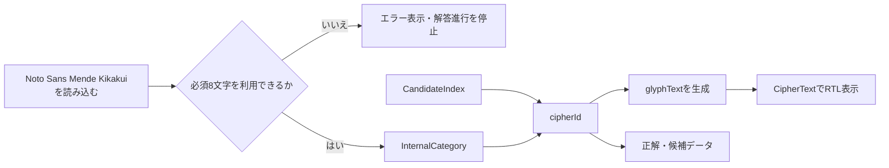

- カテゴリ6文字は`U+1E865`、`U+1E822`、`U+1E8A3`、`U+1E83D`、`U+1E845`、`U+1E83A`、候補2文字は`U+1E854`と`U+1E827`。
- 1単語はカテゴリ文字と候補文字の2文字。
- 文中のトークン配列は左から右、各単語内部は右から左。
- 正誤判定は`cipherId`とトークンIDで行い、字形を比較しない。
- フォントが`ready`になるまで暗号を描画せず、読込失敗時は仮英字などへ切り替えない。

## 10. 解答

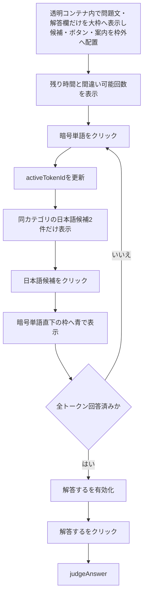

通常の`DialogueBox`はこの間描画せず、問題文を二重表示しない。カテゴリ名は表示しない。継続可能な誤答後は内容を変更していなくても`解答する`を再送信できる。

## 11. 判定フィードバック

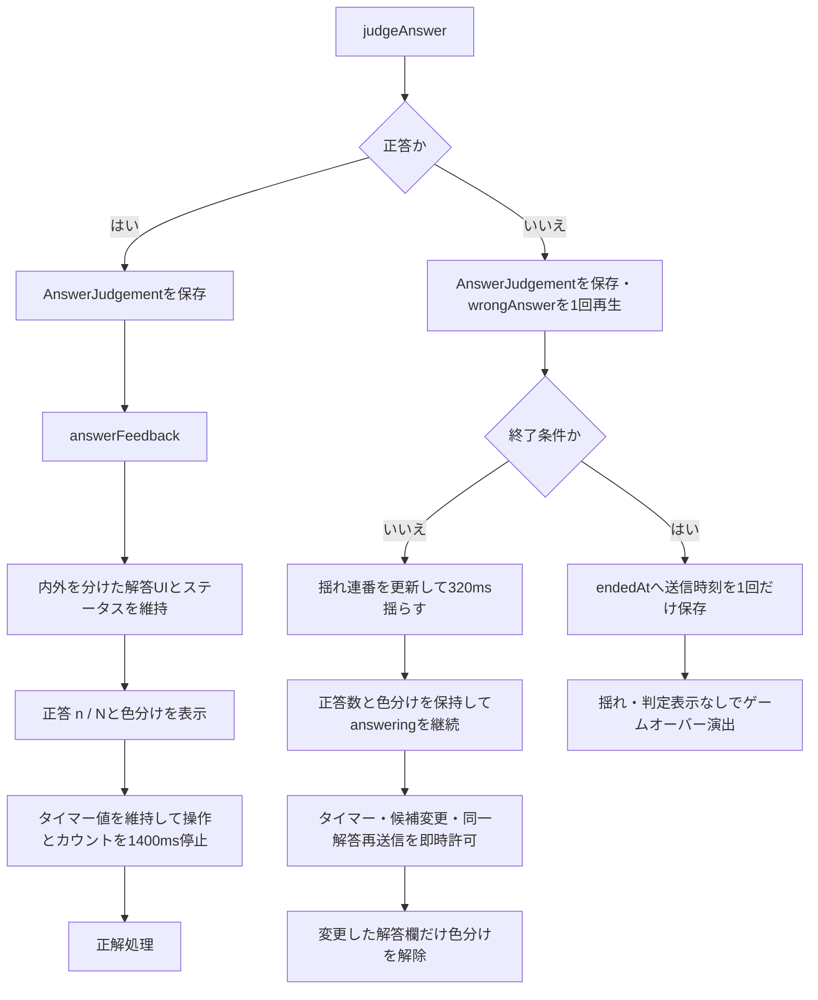

正答は緑、誤答は赤の文字と枠だけで表示し、可視ラベルは付けない。継続可能な1回目の誤答時だけダイアログを320ms揺らし、2回目は揺らさずゲームオーバー演出へ直行する。モーション低減時は1回目も揺らさない。
誤答音は継続可否に関係なく送信handlerで1回だけ鳴らし、判定表示の再描画では鳴らさない。

## 12. 誤答と時間切れ

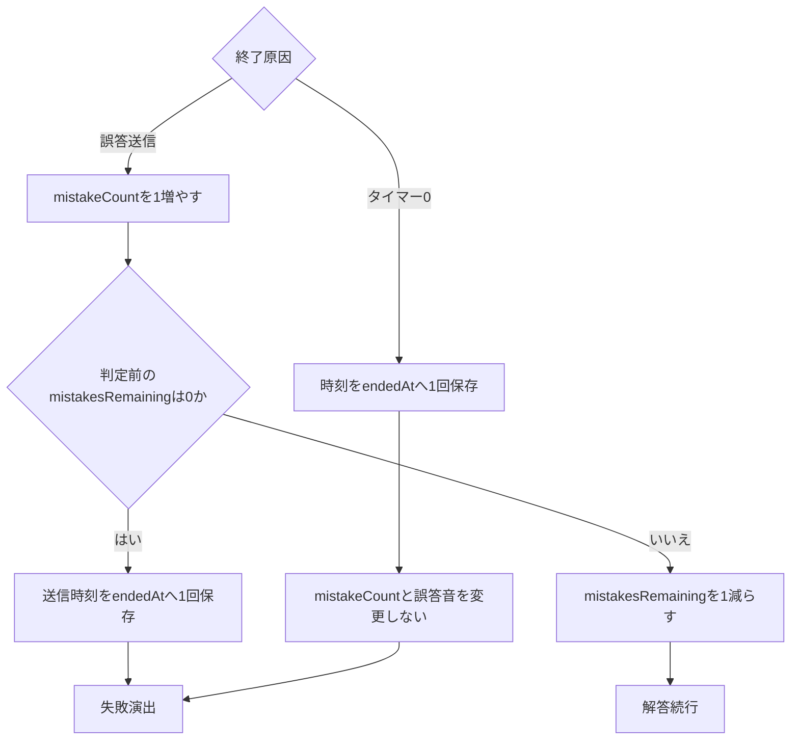

タイマーは`answering`中だけ減る。0になった同じタイマー処理で操作を停止し、判定表示を挟まず失敗演出へ進む。次レベルでは90秒へ初期化する。

## 13. 正解

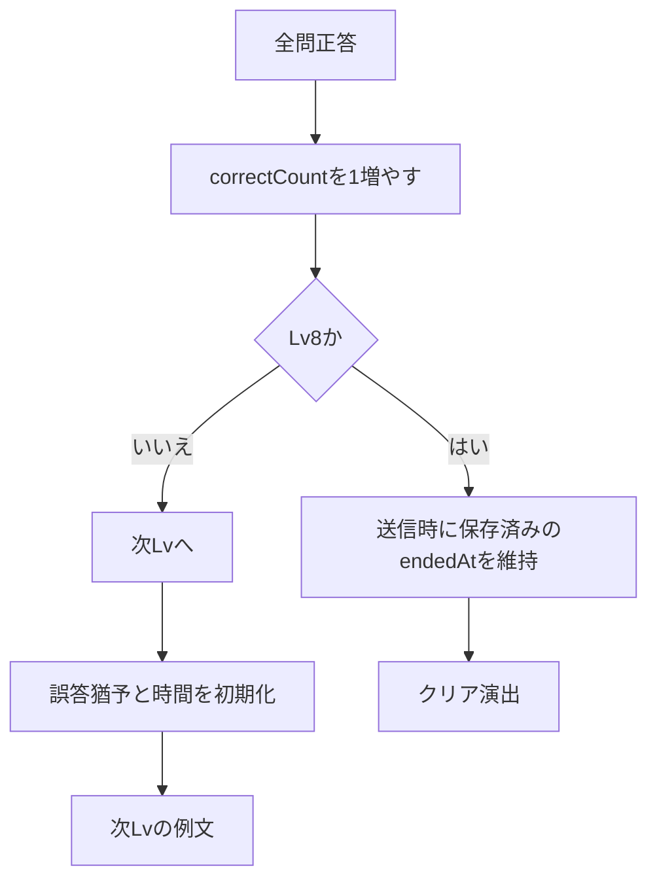

## 14. 終了演出

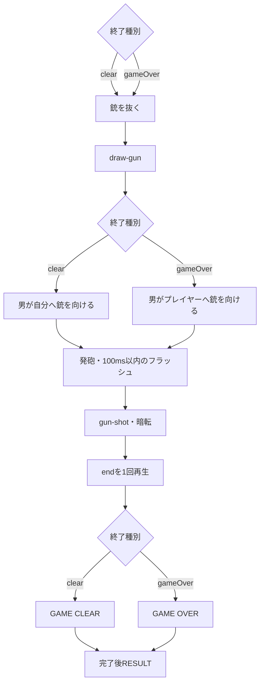

- 通常時の`GAME CLEAR`は2400ms、`GAME OVER`は2300ms。
- モーション低減時は1500msのフェード。
- 発砲演出と終了タイトルも通常進行と同じFigma node `13:66`の照明を同じ配置で使う。発砲フラッシュと発砲直後の暗転だけは一時的に照明を覆う。
- `endedAt`は終了条件の送信時刻または時間切れ確定時刻のまま変更せず、判定表示と終了演出の時間を経過時間へ含めない。

## 15. リザルトとリトライ

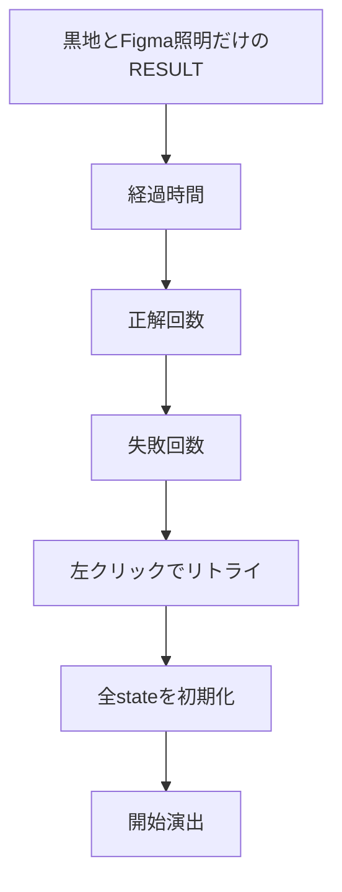

## 16. 設定値

| 項目 | 値 |
| --- | --- |
| 最終レベル | 8 |
| 誤答猶予 | 1 |
| 制限時間の変更可能な既定値 | 90秒 |
| 警告開始の変更可能な既定値 | 15秒 |
| 手帳1見開き | 最大6件、左3件から右3件の順で固定配置 |
| NEW | 上下4px、1往復1800ms |
| 判定表示 | 1400ms |
| 誤答パネル揺れ | 問題・解答パネルだけ320ms、左右約10px、減衰付き |
| 開始演出 | 2300ms |
| 開始演出・モーション低減 | 300ms |
| 素材読込タイムアウト | 5000ms |
| 発砲フラッシュ | 最大100ms |
| GAME OVER | 2300ms |
| GAME CLEAR | 2400ms |
| 終了タイトル・モーション低減 | 1500ms |

## 17. 通し確認

- 開始演出から導入、Lv1〜Lv8、クリアまで進める。
- 同一タブをブラウザ再読込しても開始暗転が再生されず、ゲーム内リトライでは開始演出が再生されることを確認する。
- 導入、例文、問題単独提示ではステータスがなく、問題クリック後に内外を分けた解答UIとステータスが同時に現れることを確認する。
- 会話送りでは`next→`、問題単独提示から解答受付へ入る時は`answer→`が会話枠右下へ表示され、解答受付中の案内が`Spaceで手帳を開く`だけになることを確認する。
- 各Mende単語と直下の解答枠が組で並び、Lv8と縮小画面でも組のまま折り返すことを確認する。
- 会話、問題、手帳に話者名と括弧がなく、手帳見出しも表示されないことを確認する。
- 通常会話枠が1920×1080基準の`y=824`にあり、解答UIでは問題と解答欄だけが大枠内、候補、送信ボタン、案内、判定数が大枠外にあることを確認する。日本語候補は共通の大枠を持たず、各候補が`#111`背景の個別枠になり、手帳操作案内は見開き画像外にあることを確認する。
- 会話操作案内が会話枠外の中央下、`next→` / `answer→`が枠内右下にあり、照明nodeと画像内インセットがFigma node `13:66`の座標に一致することを確認する。
- 1回目と2回目の誤答、時間切れ即終了を確認する。
- 提示例文と正答履歴、左詰め、NEW既読、見開き境界、背景付き`a/b`、履歴の可読性、Space、A/D、標準Tabを確認する。
- 左クリックやドラッグでゲーム内文字が範囲選択されず、フォーカス中のボタンでSpaceを押しても候補選択・解答送信・リトライが発火しないことを確認する。TabとEnterの標準操作は維持する。
- 手帳表示中もタイマーが進み、0秒で即終了することを確認する。
- Mende文字、文字方向、フォントエラーを確認する。
- 正答の判定中は内外を分けた解答UIとステータスが見え、値を維持したまま停止することを確認する。継続可能な誤答では選択と色分けを保持して即時再開し、同一解答を再送信できることを確認する。
- 1回目の誤答では問題・解答パネルだけが320ms揺れ、候補とボタンは揺れないこと、2回目は揺れと判定表示なしでゲームオーバー演出へ進むこと、可視ラベルなしの緑・赤表示、モーション低減を確認する。
- 読込、開始、通常進行、手帳、両発砲演出、両終了タイトル、リザルトで同じFigma照明SVGと配置が維持されることを確認する。
- 通常、抜銃、プレイヤー照準、自分照準で服の黒とえんじ色が連続し、机、フクロウ、手帳、ペンも同じローポリゴン調で表示されることを確認する。
- リザルト背景が黒地とFigma照明だけで、人物、机、手帳、ビネットがないことを確認する。
- 両発砲演出、終了タイトル、音、リザルト、リトライを確認する。
- listener、timeout、効果音が多重登録・多重再生されないことを確認する。
