# プロダクト全体フロー図

最終更新: 2026-07-20
ステータス: 仕様承認済み・実装未完了

## 1. 目的

ゲーム起動からリトライまでの画面状態、会話、例文、手帳、解答、判定、終了演出の関係を定義する。

## 2. 前提

- Next.js App Routerの1ページゲームとし、サーバー処理、DB、移動操作を使わない。
- 主な入力は左クリック、Space、A/D。Tabはゲーム操作に使わない。
- 暗号はMende Kikakuiの実Unicode文字で表示する。
- Lv1からLv8まで進み、各レベルで例文提示、問題提示、解答を行う。
- 各問題の誤答猶予は1回。時間切れだけでは即終了しない。

## 3. 全体フロー

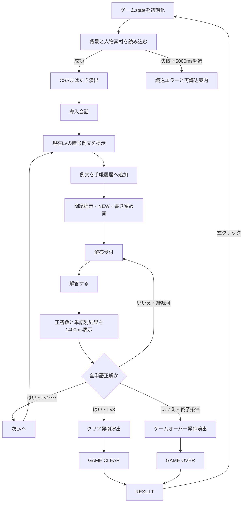

## 4. gamePhase

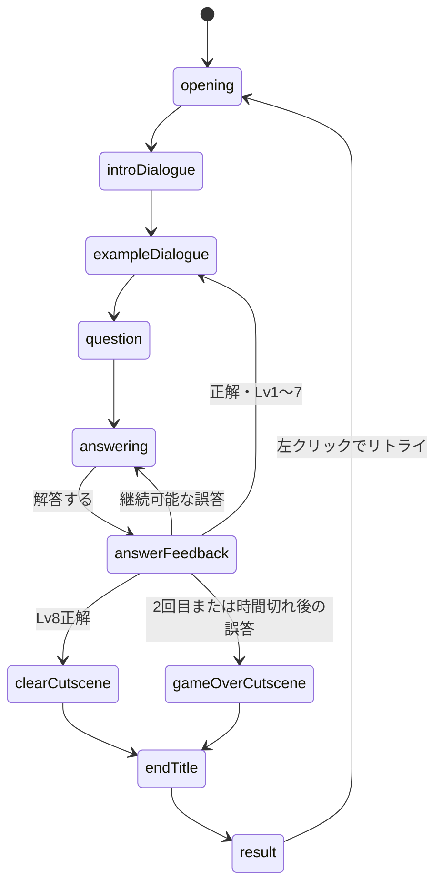

## 5. 開始演出

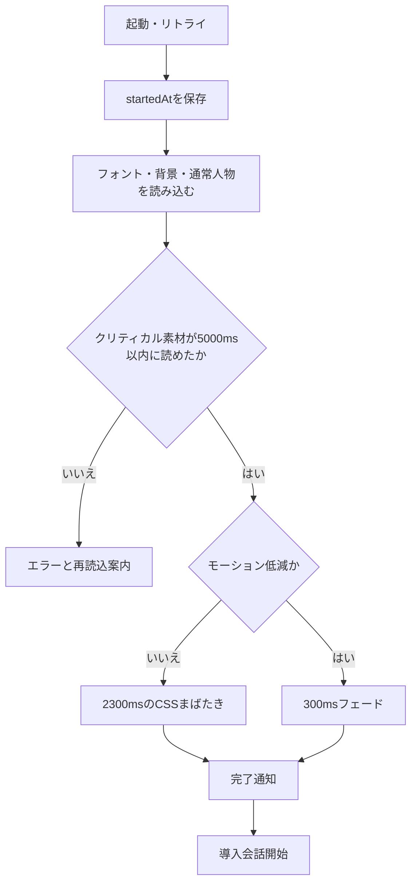

演出中は会話、手帳、解答を受け付けない。完了は専用`animationend`と+250msのフォールバックを同じ一度きりのガードへ接続する。

## 6. 会話表示

| 種類 | 話者 | 色 | 内容 |
| --- | --- | --- | --- |
| 通常 | 地の文 | 白 | 導入、状況説明 |
| 暗号 | 男 | 赤 | 暗号例文、問題文 |
| 日本語訳 | 男 | 青 | 例文の日本語訳 |
| 解答 | プレイヤー | 青 | 判定前の選択済み日本語 |

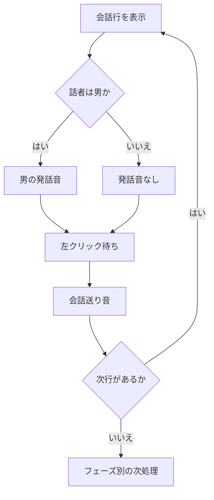

導入会話の本文と順番は`src/data/introDialogues.ts`を正とし、全行を地の文として扱う。

## 7. ラウンド

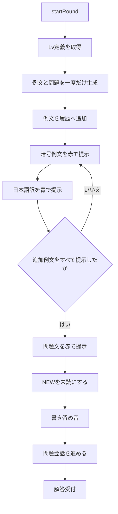

問題提示時に手帳がすでに開いている場合は、最新ページへ移動し、NEWを既読のままにする。

## 8. 手帳とNEW

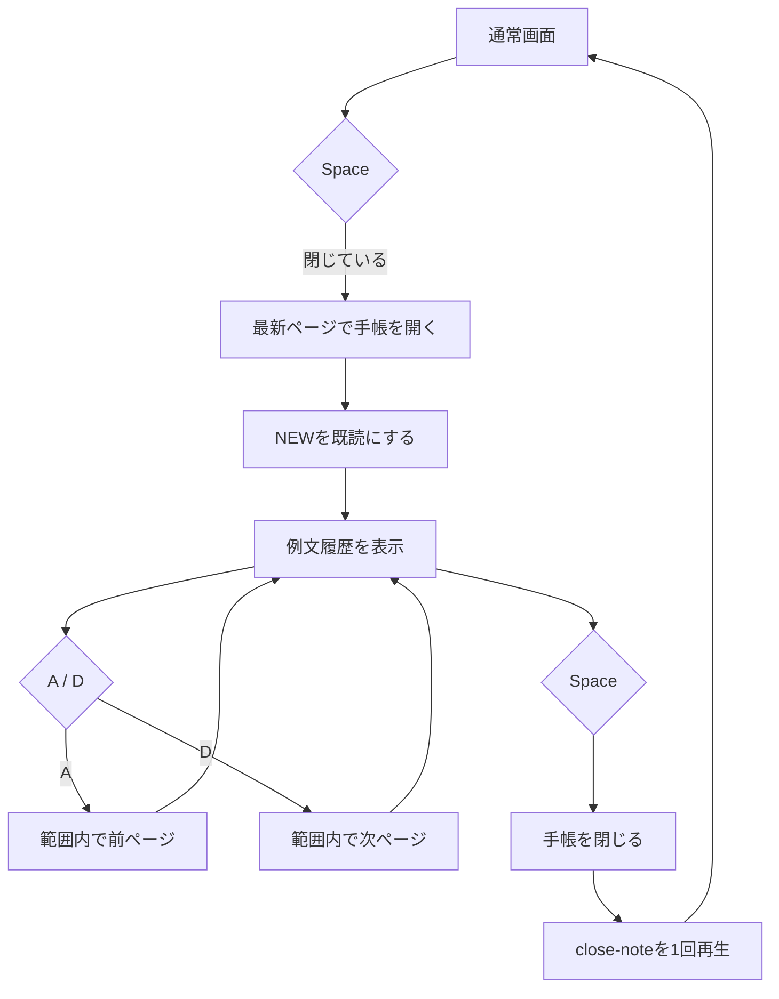

- 1ページに例文を2件表示する。
- 履歴はレベルをまたいで保持する。
- 別タブ、推理入力、中央候補リスト、閉じるボタンはない。
- Tabはブラウザ標準のフォーカス移動を行う。
- NEWは上下4px、1往復1800msで動き、モーション低減時は静止する。

## 9. 暗号表示

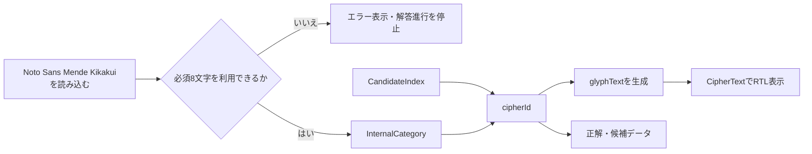

- カテゴリ6文字は`U+1E800`〜`U+1E805`、候補2文字は`U+1E806`と`U+1E807`。
- 1単語はカテゴリ文字と候補文字の2文字。
- 文中のトークン配列は左から右、各単語内部は右から左。
- 正誤判定は`cipherId`とトークンIDで行い、字形を比較しない。
- フォントが`ready`になるまで暗号を描画せず、読込失敗時は仮英字などへ切り替えない。

## 10. 解答

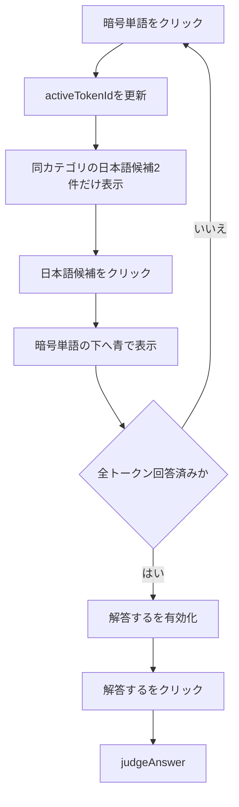

カテゴリ名は表示しない。前回の判定から内容を変更していない場合は`解答する`を無効にする。

## 11. 判定フィードバック

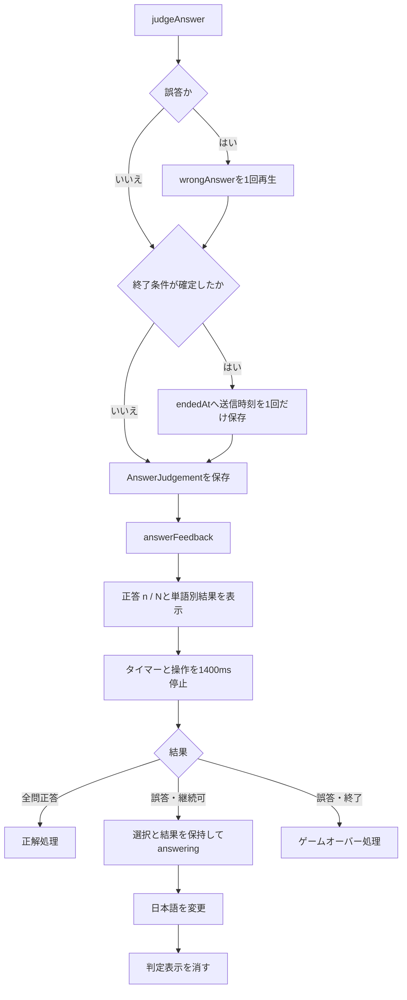

正答は緑と`正答`ラベル、誤答は赤と`誤答`ラベルで表示する。
誤答音は継続可否に関係なく送信handlerで1回だけ鳴らし、判定表示の再描画では鳴らさない。

## 12. 誤答と時間切れ

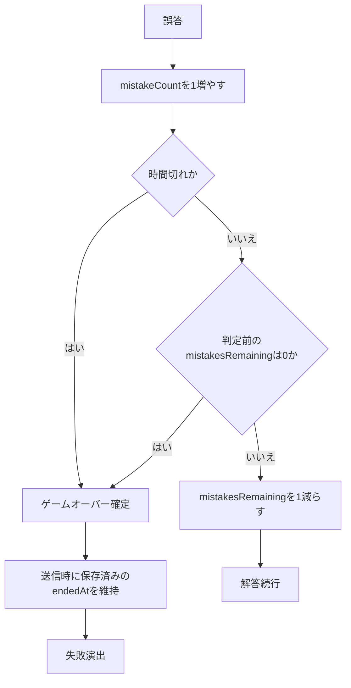

タイマーは`answering`中だけ減る。0になっても即終了せず、次の誤答で終了する。次レベルでは90秒と時間切れ状態を初期化する。

## 13. 正解

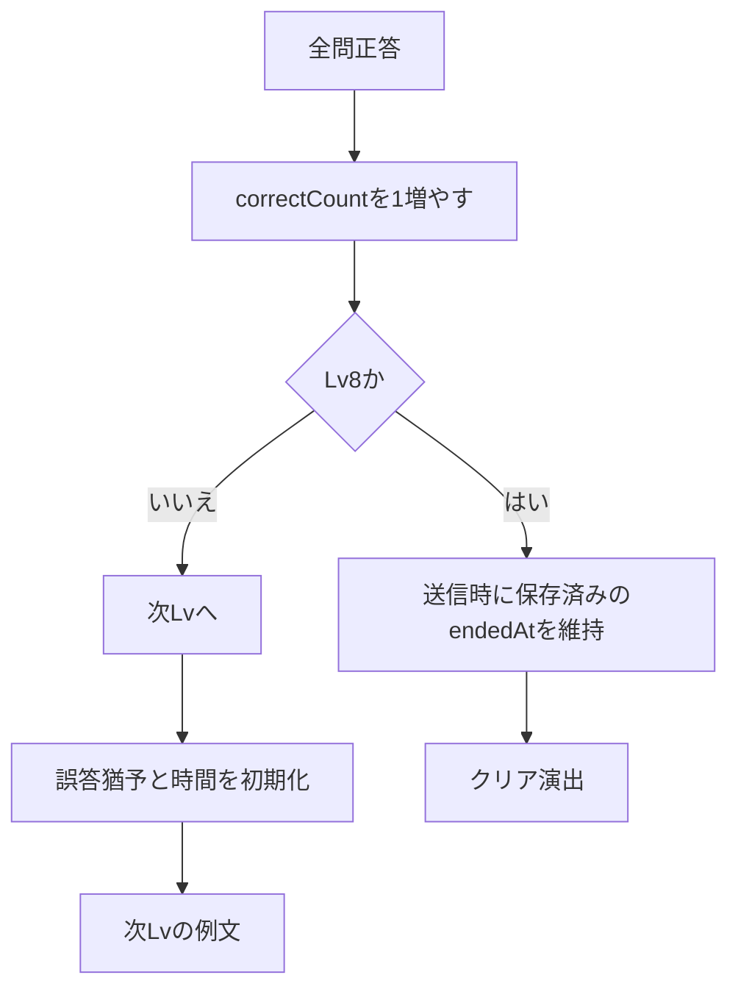

## 14. 終了演出

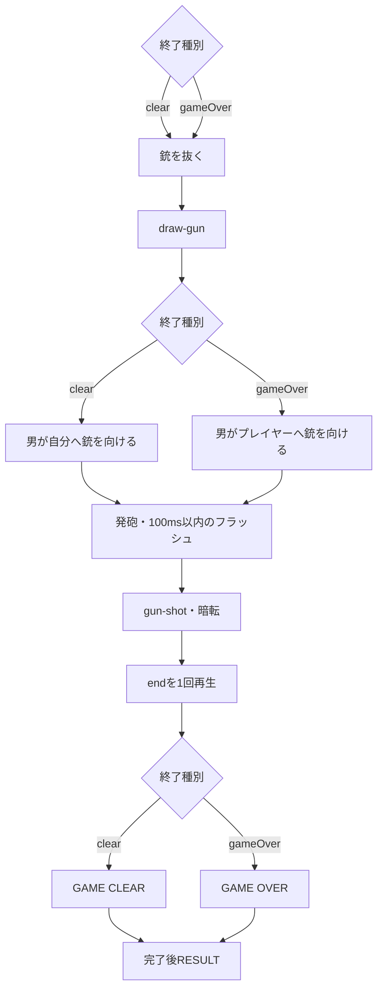

- 通常時の`GAME CLEAR`は2400ms、`GAME OVER`は2300ms。
- モーション低減時は1500msのフェード。
- `endedAt`は送信時の判定確定時刻のまま変更せず、1400msの判定表示と終了演出の時間を経過時間へ含めない。

## 15. リザルトとリトライ

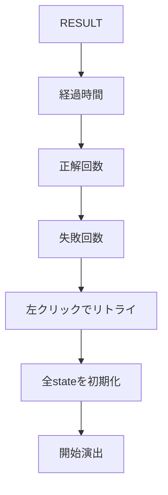

## 16. 設定値

| 項目 | 値 |
| --- | --- |
| 最終レベル | 8 |
| 誤答猶予 | 1 |
| 制限時間の変更可能な既定値 | 90秒 |
| 警告開始の変更可能な既定値 | 15秒 |
| 手帳1ページ | 例文2件 |
| NEW | 上下4px、1往復1800ms |
| 判定表示 | 1400ms |
| 開始演出 | 2300ms |
| 開始演出・モーション低減 | 300ms |
| 素材読込タイムアウト | 5000ms |
| 発砲フラッシュ | 最大100ms |
| GAME OVER | 2300ms |
| GAME CLEAR | 2400ms |
| 終了タイトル・モーション低減 | 1500ms |

## 17. 通し確認

- 開始演出から導入、Lv1〜Lv8、クリアまで進める。
- 1回目の誤答、2回目の誤答、時間切れ後の誤答を確認する。
- 手帳履歴、NEW既読、ページ境界、Space、A/D、標準Tabを確認する。
- Mende文字、文字方向、フォントエラーを確認する。
- 判定中の停止、選択保持、同一解答の再送信禁止を確認する。
- 両発砲演出、終了タイトル、音、リザルト、リトライを確認する。
- listener、timeout、効果音が多重登録・多重再生されないことを確認する。
