# プロダクト全体フロー図

## 目的

一人称視点の暗号推理ゲームについて、ゲーム開始から終了までの進行、会話表示、暗号問題、正解時と不正解時の分岐を実装担当が理解できる形で整理する。

最終決定者はPMの@ly(らい)とする。

## 前提

- 実装はNext.jsの1ページ構成とする。
- サーバー処理や高度なルーティングは扱わない。
- Reactのstate、props、onClick、キーボード入力で進行を管理する。
- 操作は主に左クリック、Spaceキー、Tabキー、A/Dキーを使う。
- BGMは使わず、効果音のみ使用する。
- プレイヤーは椅子に縛られており、移動操作はない。
- ゲーム画面は一人称視点の固定画面とする。
- 男は例文と問題のみを喋る。
- 導入文や状況説明は地の文として表示する。
- Lv1からLv8まで順番に進行し、Lv8の問題に正解するとクリア演出へ進む。
- 各問題で1回だけ誤答してもセーフとする。

## 全体フロー

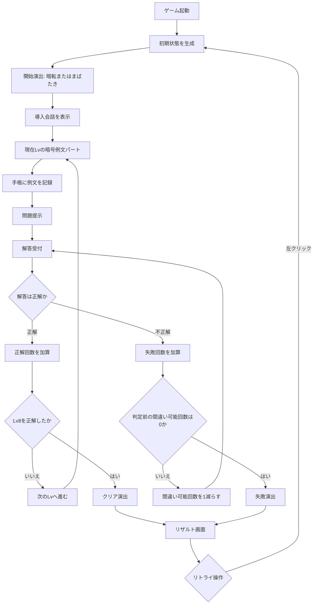

## ゲーム状態の流れ

実装では、画面全体の状態を`gamePhase`のようなstateで管理すると分かりやすい。

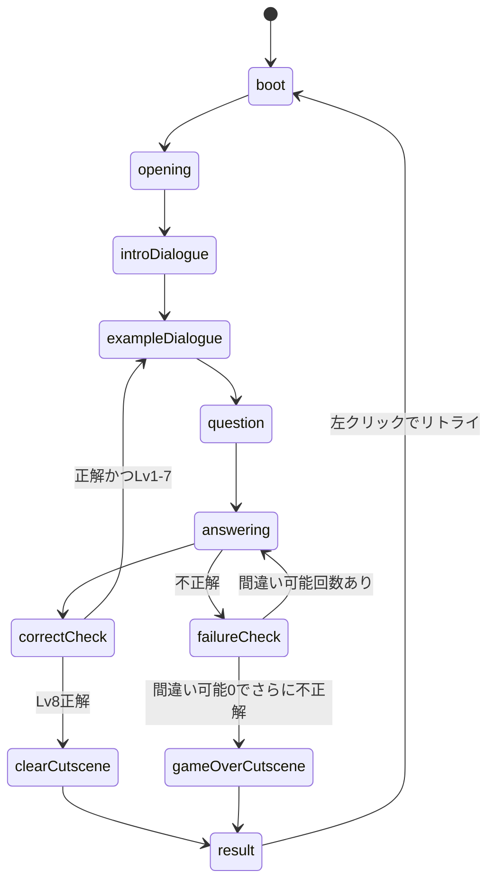

## 会話表示フロー

会話は、通常会話、暗号例文、日本語訳、解答文で表示色を分ける。

| 種類 | 表示色 | 内容 |
| --- | --- | --- |
| 通常会話 | 白 | 導入文、状況説明 |
| 暗号例文 | 赤 | 男が提示する暗号文 |
| 日本語訳 | 青 | 暗号に対応する日本語訳 |
| 解答 | 青 | プレイヤーが選んだ日本語 |

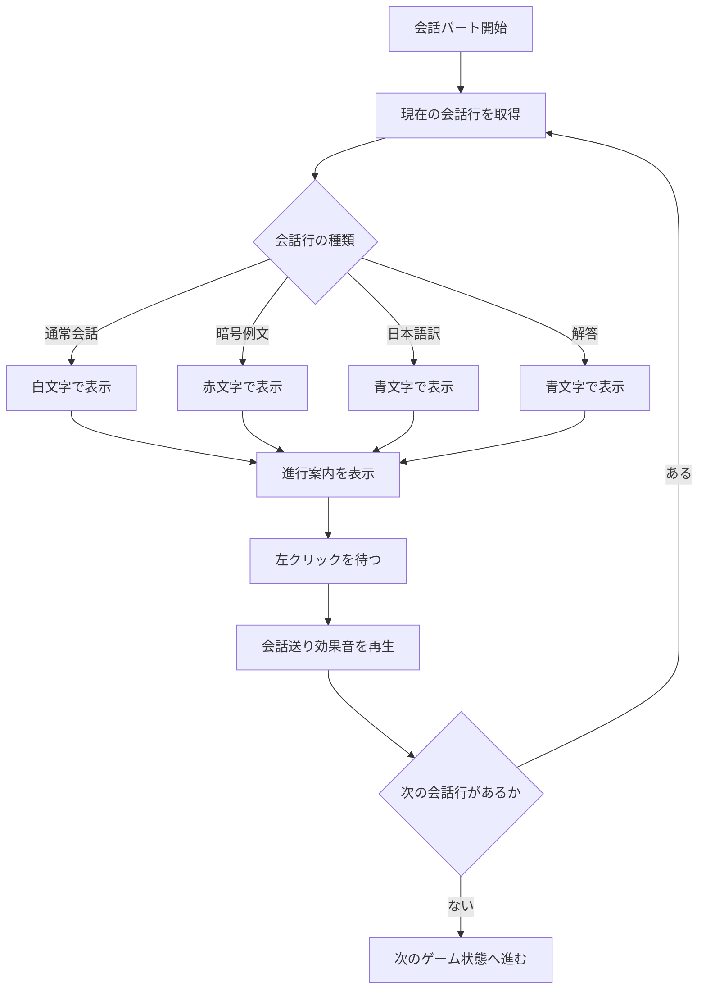

導入会話は以下の順番で表示する。

1. ここは・・・？
2. 目を覚ますと、知らない場所にいた。
3. どうやら、椅子に縛られて動けないようだ。
4. 目の前の机には手帳とペンが置いてあり、その奥には仮面を付けた男が座っている。
5. 男が話しかけてきた・・・

導入会話は全て地の文として扱い、男のセリフにはしない。

## 暗号問題フロー

暗号例文パートでは、男が暗号文と日本語訳を交互に提示する。提示された内容はすべて手帳に記録される。

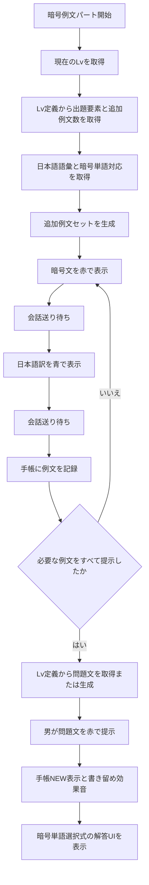

## 手帳フロー

手帳はプレイヤーが過去の例文を見返し、暗号単語と日本語単語の対応を推測して記録するための補助UIとする。

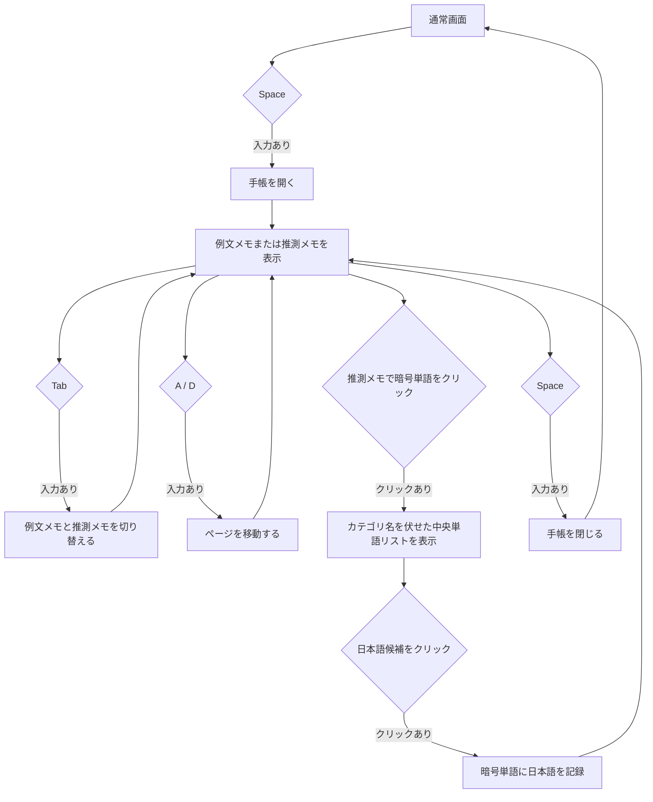

手帳の表示内容は以下を想定する。

| 項目 | 内容 |
| --- | --- |
| 例文履歴 | 男が提示した暗号文と日本語訳 |
| 推測メモ | `暗号単語 → 推測した日本語単語` の対応 |
| NEW表示 | 問題提示に切り替わった瞬間に出す通知。例文追加時や推測メモ更新時には出さない |

## 解答フロー

プレイヤーは日本語で解答する。入力欄に文字を打つのではなく、暗号単語をクリックし、日本語候補から対応を選んで答えを組み立てる。

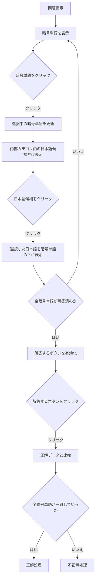

解答UIでは、内部品詞・カテゴリ名はプレイヤーに表示しない。単語を選んだ時点では合否判定せず、全ての暗号単語に解答した後に`解答する`ボタンを押した時だけ判定する。

## 正解時の分岐

正解時は大きな演出を入れず、少し間を置いて次のLvへ進む。Lv8で正解した場合はクリア演出へ進む。

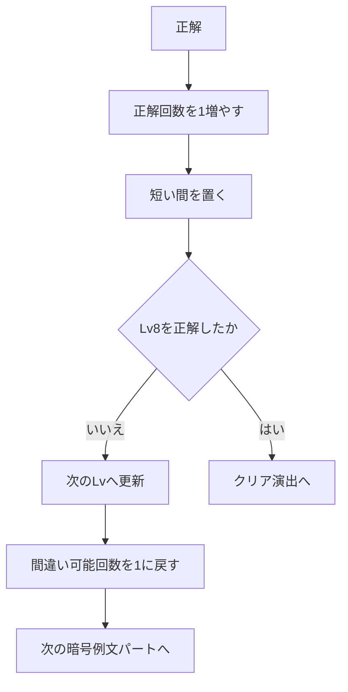

## 不正解時の分岐

各問題開始時の間違い可能回数は`1`とする。1回目の誤答はセーフで、同じ問題内でさらに誤答するとゲームオーバーになる。

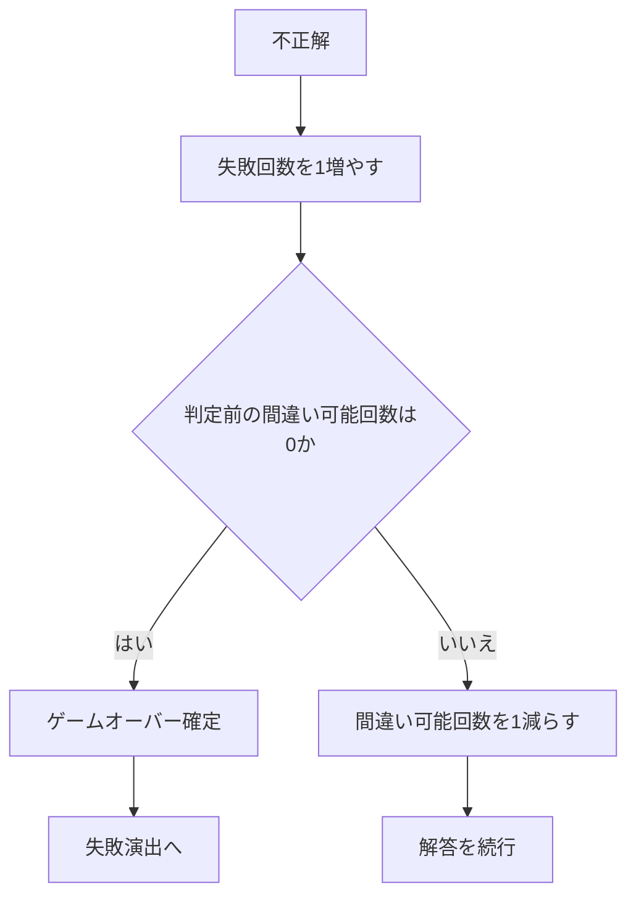

## 失敗演出フロー

失敗時は紙芝居のように2シーン以上の切り替えで表現する。

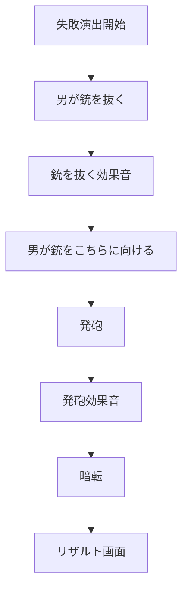

## クリア演出フロー

クリア時も銃を使うが、男が自分に向ける点が失敗演出と異なる。

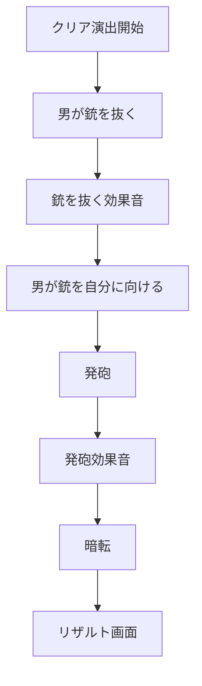

## リザルトフロー

リザルト画面では、クリアとゲームオーバーのどちらでも結果を表示する。

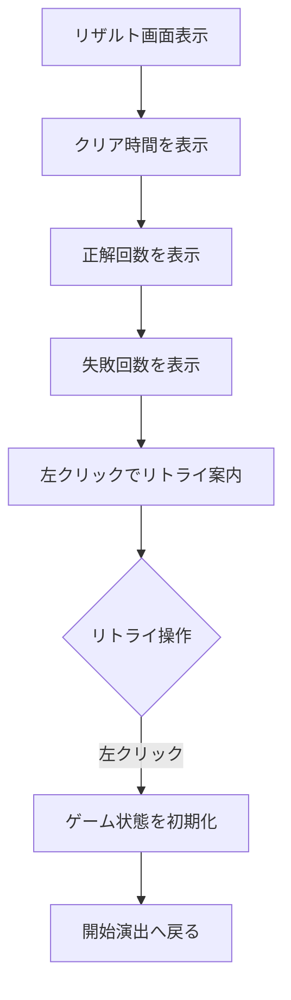

## 実装担当向けの画面構成

1ページ内で以下のUI部品を状態に応じて出し分ける。

| UI部品 | 役割 |
| --- | --- |
| 背景 | 暗い部屋、一人称視点、机、男、照明を表示 |
| 男の表示 | 通常、銃を抜く、銃を向ける、自分に向けるなどの差分を表示 |
| 会話表示 | 白、赤、青のテキストを表示 |
| 操作案内 | 左クリック、Space、Tab、A/Dの案内を表示 |
| 手帳UI | 例文履歴と推測メモを表示 |
| 選択肢UI | 暗号単語、選択中の暗号単語に対応する日本語候補、解答するボタンを表示 |
| リザルト | クリア時間、正解回数、失敗回数を表示 |

## 実装担当向けのstate案

最低限、以下のstateがあると実装しやすい。

| state名 | 内容 |
| --- | --- |
| `gamePhase` | `opening`、`introDialogue`、`exampleDialogue`、`question`、`answering`、`clearCutscene`、`gameOverCutscene`、`result`など |
| `dialogueIndex` | 現在表示している会話の番号 |
| `dialogueLines` | 表示する会話データの配列 |
| `currentQuestion` | 現在の暗号問題データ |
| `examples` | 手帳に記録する例文履歴 |
| `noteMappings` | プレイヤーが手帳に書いた `暗号単語 → 日本語単語` の推測対応 |
| `selectedAnswers` | プレイヤーが問題画面で選んだ `暗号単語ID → 日本語単語` の解答 |
| `selectedCipherTokenId` | 解答中に選択している暗号単語ID |
| `mistakesRemaining` | 間違い可能回数 |
| `correctCount` | 正解回数 |
| `mistakeCount` | 失敗回数 |
| `isNotebookOpen` | 手帳が開いているかどうか |
| `notebookMode` | `examples`または`memos`のどちらのメモを開いているか |
| `notebookPage` | 現在開いている手帳ページ |
| `currentLevel` | 現在のLv。1から8まで |

## データ構造案

会話データは表示色を切り替えやすいように、テキストと種類をセットにする。

```ts
type DialogueLine = {
  speaker?: "narration" | "man" | "player";
  text: string;
  type: "normal" | "cipher" | "translation" | "answer";
};
```

暗号問題は、暗号単語ごとの対応を比較できる形にする。

```ts
type WordCategory =
  | "color"
  | "quality"
  | "humanNoun"
  | "animalNoun"
  | "quantity"
  | "verb";

type QuestionToken = {
  id: string;
  cipher: string;
  category: WordCategory;
  correctJa: string;
};

type Question = {
  level: number;
  tokens: QuestionToken[];
  correctAnswers: Record<string, string>;
  choiceCandidatesByTokenId: Record<string, string[]>;
};
```

`choiceCandidatesByTokenId`には、選択中の暗号単語に対応する内部カテゴリ内の候補だけを入れる。品詞名・カテゴリ名は画面に表示しない。

手帳の例文履歴は、暗号文と日本語訳をセットで保存する。

```ts
type ExampleRecord = {
  level: number;
  cipherText: string;
  translation: string;
  tokens: { cipher: string; ja: string; category: WordCategory }[];
};
```

## 確定済みの日本語語彙

日本語の単語は`game-rule.md`で確定している。内部品詞・カテゴリ名は実装上だけで使い、プレイヤーには表示しない。

| 内部品詞・カテゴリ | 候補1 | 候補2 |
| --- | --- | --- |
| 色 | 赤い | 青い |
| 性質 | 大きな | 小さな |
| 人系名詞 | 男 | 女 |
| 動物系名詞 | 犬 | 猫 |
| 数量 | いくつかの | たくさんの |
| 動詞 | 見る | 追う |

## 暗号表記の仮ルール

暗号表記は未確定であり、以下は実装確認用の仮例とする。最終的に存在しないアルファベット単語にするか、暗号フォントを作るかはPMが決定する。

仮ルールでは、暗号単語を`語幹 + 語尾`で作る。

- 語幹は内部品詞・カテゴリを表す。
- 語尾は、その内部品詞・カテゴリ内の1つ目・2つ目の候補を表す。
- 語幹と語尾のセットで1単語として扱う。
- 語尾の対応は全カテゴリで共通にする。

| 語幹 | 内部品詞・カテゴリ |
| --- | --- |
| `ra` | 色 |
| `do` | 性質 |
| `ta` | 数量 |
| `vi` | 動詞 |
| `hu` | 人系名詞 |
| `ke` | 動物系名詞 |

| 語尾 | 意味 |
| --- | --- |
| `ka` | 1つ目の候補 |
| `mi` | 2つ目の候補 |

| 内部品詞・カテゴリ | 1つ目 `ka` | 2つ目 `mi` |
| --- | --- | --- |
| 色 `ra` | `raka` = 赤い | `rami` = 青い |
| 性質 `do` | `doka` = 大きな | `domi` = 小さな |
| 数量 `ta` | `taka` = いくつかの | `tami` = たくさんの |
| 動詞 `vi` | `vika` = 見る | `vimi` = 追う |
| 人系名詞 `hu` | `huka` = 男 | `humi` = 女 |
| 動物系名詞 `ke` | `keka` = 犬 | `kemi` = 猫 |

## Lv構成

Lv1からLv8まで順番に進行する。Lv8の問題に正解するとクリア演出へ進む。

| レベル | 出題に使う要素 | 正解例 |
| --- | --- | --- |
| Lv1 | 色2個 + 人系名詞2個 | 青い 女 |
| Lv2 | 色2個 + 名詞4個 | 赤い 猫 |
| Lv3 | 性質2個 + 名詞4個 | 大きな 犬 |
| Lv4 | 数量2個 + 名詞4個 | たくさんの 猫 |
| Lv5 | 動詞2個 + 名詞4個 | 男 追う |
| Lv6 | 色2個 + 性質2個 + 名詞4個 | 赤い 小さな 女 |
| Lv7 | 数量2個 + 動詞2個 + 名詞4個 | いくつかの 男 見る |
| Lv8 | 色2個 + 性質2個 + 数量2個 + 動詞2個 + 名詞4個 | たくさんの 青い 小さな 犬 追う |

仮暗号表記を使う場合の出題例は以下とする。

| レベル | 暗号問題 | 正解 |
| --- | --- | --- |
| Lv1 | `rami humi` | 青い 女 |
| Lv2 | `raka kemi` | 赤い 猫 |
| Lv3 | `doka keka` | 大きな 犬 |
| Lv4 | `tami kemi` | たくさんの 猫 |
| Lv5 | `huka vimi` | 男 追う |
| Lv6 | `raka domi humi` | 赤い 小さな 女 |
| Lv7 | `taka huka vika` | いくつかの 男 見る |
| Lv8 | `tami rami domi keka vimi` | たくさんの 青い 小さな 犬 追う |

## 例文追加数

例文と推測メモは次の問題に持ち越し、正解後もリセットしない。

| レベル | 追加内容 | 追加例文数 | 累計例文数 |
| --- | --- | --- | --- |
| Lv1 | 色 + 人系名詞 | 3個 | 3 |
| Lv2 | 動物系名詞を追加 | 1個 | 4 |
| Lv3 | 性質を追加 | 1個 | 5 |
| Lv4 | 数量を追加 | 1個 | 6 |
| Lv5 | 動詞を追加 | 1個 | 7 |
| Lv6 | 色 + 性質 + 名詞 | 1個 | 8 |
| Lv7 | 数量 + 名詞 + 動詞 | 1個 | 9 |
| Lv8 | 全部入り | 1個 | 10 |

## 効果音の発生タイミング

| タイミング | 効果音 |
| --- | --- |
| 会話を送る | ページ送り、クリック音など |
| 男が喋る | 暗号例文、対応する日本語訳、問題文など、男のセリフ行が表示された瞬間に鳴らす |
| 問題が出る | 問題提示に切り替わった瞬間に書き留める音を鳴らす |
| 銃を抜く | 金属音、衣擦れ音など |
| 発砲 | 銃声 |

## PM決定項目

`game-rule.md`により、クリア条件、日本語語彙、Lv構成、誤答ルール、手帳操作、時間切れ後の扱いは確定済みとする。以下はPMが追加で判断する項目とする。

| 項目 | 決定内容 |
| --- | --- |
| 暗号表現 | 特殊フォントにするか、存在しない英単語風にするか |
| 制限時間の数値 | 初期案の1問90秒、警告15秒で確定するか |
| 失敗演出の枚数 | 紙芝居演出を何シーンに分けるか |
| クリア演出の枚数 | 紙芝居演出を何シーンに分けるか |
| 効果音素材 | 会話送り、男の発話、書き留め、銃、発砲の具体SE |

## 担当別の確認ポイント

| 担当 | 確認ポイント |
| --- | --- |
| @ly(らい) | 演出順、暗号表記、SE方針、未定義要素を最終決定する |
| @ささかまぼこ。 | 固定画面、男、机、手帳、選択肢、リザルトのレイアウトを作る |
| @かまぼこ(本物) | React state、会話送り、解答判定、手帳表示を実装する |
| @ほっそー | Lvデータ、暗号データ生成、効果音再生、演出切り替えを実装する |

## 実装の優先順

1. 画面を1ページで表示する。
2. `gamePhase`と`currentLevel`で開始、会話、問題、リザルトを切り替える。
3. 左クリックで会話送りを実装する。
4. Lv1からLv8のデータを用意し、暗号例文と日本語訳を表示して手帳に保存する。
5. Spaceで手帳を開閉し、Tabでメモ切替、A/Dでページ移動する。
6. 暗号単語クリック後、該当カテゴリ内の日本語候補だけを表示する。
7. `解答する`ボタン押下時だけ正解判定、不正解判定、失敗回数を処理する。
8. 各問題1回だけ誤答セーフの分岐を実装する。
9. 失敗演出、クリア演出、リザルトを実装する。
10. 効果音と画面演出を追加する。
