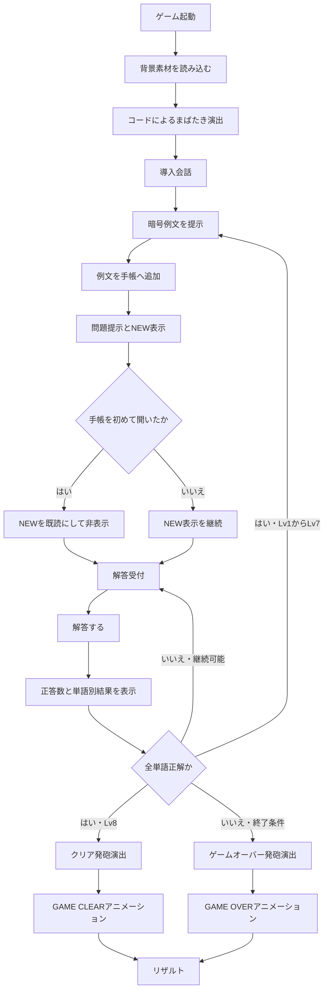

# テスト版完成に向けた変更仕様書

作成日: 2026-07-17  
版: 0.2  
対象: UI・絵担当、実装担当  
最終決定: @ly(らい) / PM  
ステータス: PMレビュー案  
承認日: 未承認

## 1. この仕様書の位置付け

本書は、テスト版完成に向けて提示された変更要求を、既存のUI仕様・ゲームルール・実装仕様へ反映するための差分仕様書である。

- 本書の内容は、PM承認前は変更案として扱う。
- 本書は、UI担当と実装担当がテスト版を制作するための変更仕様として使用する。
- 数値、色、フォント素材、アニメーション時間の最終決定はPMが行う。
- ゲームの基本ルール、Lv1からLv8の構成、日本語語彙、誤答可能回数、制限時間の扱いは、明記した箇所以外は変更しない。

## 2. 変更要求一覧

| ID | 変更要求 | 本書での仕様化 | PM判断 |
| --- | --- | --- | --- |
| C01 | `NEW`のUIを上下にアニメーションさせる | ラベルと矢印を一体で上下移動させる | 承認待ち |
| C02 | 一度メモを開いたら`NEW`を消す | 新着ごとに、最初に手帳を開いた時点で既読にする | 承認待ち |
| C03 | 推測メモとTab切り替えを削除する | 手帳を例文メモ専用にし、関連UI・state・props・操作を削除する | 承認待ち |
| C04 | 暗号に言語フォントを使う | 仮英字を画面へ出さず、専用フォントの字形で表示する | 承認待ち |
| C05 | 判定時に正答単語数と単語別結果を出す | `正答 n / N`と単語単位の色分けを表示する | 承認待ち |
| C06 | 開始時のまばたきをコードで実装する | CSSアニメーションで上下のまぶたを描画する | 承認待ち |
| C07 | 発砲後に終了文字をアニメーション表示する | `GAME OVER`または`GAME CLEAR`を表示してからリザルトへ進む | 承認待ち |

## 3. 変更後の全体フロー



## 4. UI変更仕様

### 4.1 `NEW`通知

#### 表示内容

- 手帳の位置を指す下矢印と`NEW`を一体の通知UIとして表示する。
- 通知は通常ゲーム画面上に表示し、手帳を開いている間は表示しない。
- 背景レイアウトを押し下げないよう、絶対配置または固定レイヤーで重ねる。
- 色の初期案は、くすんだ黄白色を基本とし、暗い赤を縁または影に使う。
- ポップなバッジ表現は避け、ゲーム内の不穏な雰囲気を維持する。

#### 表示開始

- 現行仕様を維持し、例文をデータへ追加した瞬間には表示しない。
- 例文提示が終了し、問題提示へ切り替わった瞬間に表示する。
- 同じタイミングで書き留め効果音を再生する。
- 各レベルの新着は別々に扱い、次のレベルで新しい例文が追加された場合は再び表示する。

#### 上下アニメーション

| 項目 | 初期案 |
| --- | --- |
| 対象 | 下矢印と`NEW`を含む通知全体 |
| 移動範囲 | 基準位置から上へ`4px`、下へ`4px` |
| 1往復 | `1800ms` |
| easing | `ease-in-out` |
| 繰り返し | 表示中は無限、交互再生 |
| 実装 | CSS `transform: translateY()`のkeyframes |

- `top`や`margin`を連続変更せず、`transform`だけをアニメーションさせる。
- アニメーション中もクリック対象にはしない。手帳は従来どおり`Space`で開く。
- `prefers-reduced-motion: reduce`では上下移動を止め、静止表示にする。

#### 非表示条件

- `NEW`表示後、プレイヤーが手帳を閉じた状態から開いた瞬間に既読とする。
- 既読後は、同じレベル内で手帳を閉じても`NEW`を再表示しない。
- 手帳を閉じる操作だけでは既読状態を変更しない。
- 問題提示へ切り替わった時点ですでに手帳が開いている場合、その新着は表示済みとみなし、`NEW`を出さず既読にする。
- リトライ時は既読状態を初期化する。

### 4.2 手帳と推測メモの削除

#### 変更後の手帳

- 手帳に表示するのは、男が提示した暗号例文と日本語訳の履歴だけとする。
- `例文メモ`という見出しは残してもよいが、他のタブがないため単に`手帳`としてもよい。表示名はPMが決定する。
- 過去の例文は次の問題へ持ち越し、正解後もリセットしない。
- 手帳を開いた直後は、最後に追加された例文を含むページを表示する。
- ページが複数ある場合は、`A` / `D`で前後のページへ移動する。
- 初期案では1ページに例文を2件表示し、ページ番号は`0`から`ページ総数 - 1`の範囲に制限する。
- 最初のページで`A`、最後のページで`D`を押した場合はページを変更しない。

#### 削除するもの

- 推測メモ画面
- 例文メモと推測メモのタブ
- `Tab`によるメモ切り替え
- `暗号単語 → 日本語単語`の推測対応表
- 推測メモ用の中央単語リスト
- 推測メモ用の暗い背景パネル
- 推測メモ用の選択肢とクリック処理
- 推測メモのページ番号と保持データ

#### 操作案内

変更後の手帳操作案内は以下とする。

```text
Spaceで閉じる / A・Dでページ移動
```

- 1ページしかない場合、`A・Dでページ移動`は非表示または無効表示にしてよい。
- `Tab`はゲーム操作に使わない。ブラウザ標準のフォーカス移動を妨げない。

### 4.3 暗号の言語フォント表示

#### 表示方針

- プレイヤー向け画面には、`raka`や`rami`などの仮英字を表示しない。
- 暗号文、例文、問題文、解答対象トークン、手帳内の暗号文は、同じ専用言語フォントで表示する。
- 暗号は画像として書き出さず、選択・折り返し・拡大が可能なテキストとして描画する。
- Figmaとブラウザ実装では、同じフォントソースと文字対応表から生成した各用途向けファイルを使う。

#### データと見た目の分離

- 内部ロジックでは、`color-1`や`humanNoun-2`のような安定した識別子を使う。
- 画面表示には、専用フォントが字形を持つPrivate Use Areaのコードポイント列`glyphText`を使う。
- `glyphText`にASCII英字を使用しない。初期例はカテゴリ記号を`U+E001`以降、候補記号を`U+E101`以降へ割り当てる。
- 正解判定は`glyphText`や見た目の字形ではなく、トークンIDと日本語正解データで行う。
- 現行の`語幹 + 語尾`による推理構造を残す場合、カテゴリ記号と候補記号の組み合わせが字形から判別できるフォント設計にする。
- 文字対応表そのものは内部資料とし、プレイヤー向けUIには表示しない。

#### フォント要件

| 項目 | 要件 |
| --- | --- |
| Web用ファイル | `src/assets/fonts/cipher-language.woff2` |
| Figma用ファイル | `cipher-language.ttf`または`cipher-language.otf` |
| CSS変数 | `--font-cipher-language` |
| 必須字形 | 全暗号語を構成する記号、語間スペース |
| 文字コード | 承認済み対応表に定義したPrivate Use Area |
| 利用条件 | Web埋め込み、Figma利用、形式変換、PUA字形の追加・改変、チーム内共有が許可されているもの |

```ts
import localFont from "next/font/local";

export const cipherLanguageFont = localFont({
  src: "../assets/fonts/cipher-language.woff2",
  display: "block",
  preload: true,
  variable: "--font-cipher-language",
});
```

- Figma用TTF/OTFとWeb用WOFF2は、同じフォントソースと同じコードポイント対応表から生成する。
- Web実装は`next/font/local`を使い、授業サーバの`basePath`でもフォントURLが崩れないようNext.jsのビルド対象へ含める。
- `next/font/local`が`@font-face`を生成するため、手動の`@font-face`は定義しない。
- `layout.tsx`の`html`要素またはゲーム最外要素へ`cipherLanguageFont.variable`を適用し、CSS変数を有効にする。
- 暗号用CSSクラスへ`font-family: var(--font-cipher-language)`を指定する。
- 通常会話、日本語訳、ボタン、リザルトには暗号フォントを適用しない。
- `fontStatus`を`loading`、`ready`、`error`で管理し、実際のcomputed font-familyを指定した`document.fonts.load()`の結果が1件以上であることを確認する。
- ビルド時のフォント検証で、cmapに承認済みPrivate Use Areaコードポイントがすべて含まれることを確認する。実行時の`document.fonts.load()`だけを字形検証には使わない。
- `ready`になるまで暗号本文を描画せず、`error`の場合は仮英字へ戻さず、`暗号フォントを読み込めません`というエラーを表示して解答を停止する。
- ローカル開発と授業サーバの両方でNetworkにフォントの404がないことを確認する。
- フォントの字形が確定するまで、仕様書内の例は`[色-2][人名詞-2]`のような内部用表記で示す。
- 読み上げには字形や日本語訳を渡さず、各トークンへ`暗号単語1`のような順序だけを示す`aria-label`を付ける。

### 4.4 正誤判定フィードバック

#### 表示タイミング

- 全暗号単語へ解答し、`解答する`を押した時点で単語単位の判定を行う。
- 判定結果は、次のレベル、再解答、終了演出へ移る前に表示する。
- 単語を選択しただけでは判定しない。

#### 表示内容

- 解答UIの上部または`解答する`ボタン付近に`正答 n / N`を表示する。
- `n`は正しい日本語を選べた暗号単語数、`N`は問題内の総単語数とする。
- 各暗号単語の下にある選択済み日本語を、単語ごとの結果に応じて色分けする。

| 状態 | 初期案 | 色以外の表現 |
| --- | --- | --- |
| 判定前 | 青 `#66aaff` | なし |
| 正答 | くすんだ緑 `#67c587` | 細い緑枠と`正答`の補助ラベル |
| 誤答 | くすんだ赤 `#c75b5b` | 細い赤枠と`誤答`の補助ラベル |

- 暗号文自体は従来どおり赤系で表示し、判定色を付けるのは選択済み日本語とその枠とする。
- 色覚差に配慮し、色だけでなく枠または補助ラベルでも結果を示す。
- Lv8の5単語でも`正答 3 / 5`と全トークンが画面内で読めるようにする。

#### 判定後の動作

| 結果 | 動作 |
| --- | --- |
| 全問正答・Lv1からLv7 | `正答 N / N`を`1400ms`表示後、次のレベルへ進む |
| 全問正答・Lv8 | `正答 N / N`を`1400ms`表示後、クリア演出へ進む |
| 誤答・継続可能 | 結果を`1400ms`表示し、その間は操作を止める。その後、選択内容を残したまま再解答可能にする |
| 誤答・ゲームオーバー確定 | 結果を`1400ms`表示後、ゲームオーバー演出へ進む |

- 誤答後に選択内容を全消去する現行案は廃止し、見直しやすいよう選択内容を残す。
- 継続可能な誤答では、`1400ms`後に操作とタイマーだけを再開し、前回の`正答 n / N`と単語別判定色は保持する。
- 日本語の選択内容を実際に変更した時点で、前回の`正答 n / N`と単語別判定色を消し、判定前の青表示へ戻す。
- 前回判定から選択内容を変更していない間は、同じ解答を再送信できないよう`解答する`ボタンを無効にする。
- 判定結果の表示中は、タイマーを一時停止する。

### 4.5 開始時のまばたき演出

#### 制作方針

- `暗転`、`半目`、`視界が開いた状態`の画像差分は制作しない。
- UI担当は、まぶたがない通常の背景・キャラクター・机素材だけを用意する。
- 実装側で、画面上端と下端に黒いレイヤーを配置し、CSSで上下へ移動させる。
- レイヤー内側の縁を楕円状にし、人のまぶたに見える曲線を作る。

#### 推奨タイムライン

| 経過時間 | 視界 |
| --- | --- |
| `0ms`から`300ms` | 完全な暗転 |
| `300ms`から`650ms` | 細い隙間まで開く |
| `650ms`から`820ms` | 一度閉じる |
| `820ms`から`1250ms` | 半分程度まで開く |
| `1250ms`から`1410ms` | 短く閉じる |
| `1410ms`から`2300ms` | ゆっくり全開にする |
| `2300ms` | 導入会話を開始する |

- まばたき中は会話送り、手帳、解答操作を受け付けない。
- クリティカル素材を`background-room.png`と`man-normal.png`とし、両方の読み込み完了後にアニメーションを開始する。
- クリティカル素材の読み込みに失敗した場合、または`5000ms`以内に完了しない場合は、演出を始めず`ゲーム素材を読み込めません`と再読み込み案内を表示する。
- 最外要素の完了通知専用`animationend`を受けて導入会話へ進む。視覚用まぶたのイベントや複数の独立した`setTimeout`だけで進行させない。
- リトライ時も同じ演出を最初から再生する。
- `prefers-reduced-motion: reduce`では、黒画面から`300ms`で通常画面へフェードし、複数回の開閉は行わない。
- 実装は`matchMedia("(prefers-reduced-motion: reduce)")`で完了時間を切り替え、低減時の完了通知アニメーションとフォールバックタイマーも`300ms`を使う。

### 4.6 発砲後の終了タイトル

#### 共通フロー

1. 男が銃を抜く。
2. ゲームオーバーではプレイヤーへ、クリアでは男自身へ銃を向ける。
3. 発砲音と同時に、最大`100ms`の白いフラッシュを表示する。
4. 画面を黒へ戻す。
5. 終了状態に応じたタイトルを中央へアニメーション表示する。
6. タイトルを消してからリザルト画面を表示する。

- `GAME OVER`と`GAME CLEAR`は画像ではなくHTMLテキストで表示する。
- タイトル表示中はクリックやキー入力でスキップさせない。テスト版では演出時間を一定にする。
- 強い点滅を繰り返さず、発砲フラッシュは1回だけにする。
- クリア時間計測用の`endedAt`は、クリアまたはゲームオーバーが確定した判定時に1回だけ設定し、以後の演出では変更しない。

#### `GAME OVER`の推奨アニメーション

コンセプトは、発砲の衝撃で文字が画面へ叩きつけられる演出とする。

| 区間 | 演出 |
| --- | --- |
| `0ms`から`180ms` | 不透明度`0`から`1`、拡大率`1.35`から`1`、ぼかし`12px`から`0` |
| `180ms`から`380ms` | 横方向に`-8px`、`6px`、`-3px`、`0`と小さく揺らす |
| `380ms`から`1900ms` | 静止して読ませる |
| `1900ms`から`2300ms` | 不透明度を`0`へ下げ、拡大率を`0.98`にする |

- 文字色初期案: 暗い赤`#b23a3a`
- 影初期案: 低い不透明度の赤い外側光彩
- 書体: 太めで幅の狭いサンセリフ体
- 揺れはタイトル要素だけに適用し、画面全体は揺らさない。

#### `GAME CLEAR`の推奨アニメーション

コンセプトは、暗闇から静かに文字が浮かび上がり、緊張がほどける演出とする。

| 区間 | 演出 |
| --- | --- |
| `0ms`から`500ms` | 不透明度`0`から`1`、下`18px`から定位置、ぼかし`8px`から`0` |
| `0ms`から`700ms` | 字間`0.55em`から`0.18em`へ収束させる |
| `500ms`から`1100ms` | 左から右へ1回だけ淡い光を通す |
| `1100ms`から`2000ms` | 静止して読ませる |
| `2000ms`から`2400ms` | 不透明度を`0`へ下げる |

- 文字色初期案: 象牙色`#e7e0c3`
- 光の色初期案: 低彩度の金色
- 書体: 中太のセリフ体または既存UIに合う明朝系
- 紙吹雪、粒子の大量表示、明るい祝福色は使わない。

#### モーション低減

- `prefers-reduced-motion: reduce`では、拡大、揺れ、字間変化、光の走査を無効にする。
- 低減時はタイトルを`150ms`でフェードインし、`1200ms`静止表示してから`150ms`で消す。
- 実装は`matchMedia("(prefers-reduced-motion: reduce)")`で完了時間を`1500ms`へ切り替え、完了通知アニメーションとフォールバックタイマーにも同じ値を使う。

### 4.7 リザルト画面

- リザルトの表示項目は、クリア時間、正解回数、失敗回数、リトライ案内のままとする。
- リザルトは終了タイトルのアニメーション完了後にのみ表示する。
- リザルト表示時に発砲フラッシュや終了タイトルを残さない。
- `status`に応じて`GAME OVER`または`GAME CLEAR`をリザルト内へ再表示するかはPM判断とする。初期案では重複を避けるため、リザルトの見出しは従来どおり`RESULT`とする。

## 5. 実装変更仕様

### 5.1 コンポーネント構成

変更後の主要コンポーネント案は以下とする。

```text
src/components/
  GameScreen.tsx
  DialogueBox.tsx
  ChoiceList.tsx
  Notebook.tsx
  TimerDisplay.tsx
  OpeningBlink.tsx
  CutsceneScreen.tsx
  EndTitleScreen.tsx
  ResultScreen.tsx
```

| コンポーネント | 変更内容 |
| --- | --- |
| `GameScreen` | 新着既読、判定フィードバック、開始演出、終了タイトルへの状態遷移を管理する |
| `ChoiceList` | `正答 n / N`とトークン別結果を描画する |
| `Notebook` | 例文履歴とページ移動だけを扱う |
| `OpeningBlink` | コードによる上下まぶたのアニメーションを描画する |
| `CutsceneScreen` | 銃を抜く、向ける、発砲、暗転までを描画する |
| `EndTitleScreen` | `GAME OVER`または`GAME CLEAR`をアニメーション表示する |
| `ResultScreen` | 終了タイトル完了後の結果だけを描画する |

### 5.2 ファイルと素材

```text
src/
  app/
    fonts.ts
  components/
    OpeningBlink.tsx
    OpeningBlink.module.css
    EndTitleScreen.tsx
    EndTitleScreen.module.css
  data/
    cipherGlyphs.ts
  assets/
    fonts/
      cipher-language.woff2
```

- 現行案の`cipher-font.woff2`は、採用フォント名に合わせて`cipher-language.woff2`へ統一する。
- まばたき用の黒マスク画像は追加しない。
- 終了タイトル画像は追加しない。
- `app/fonts.ts`で`next/font/local`を定義し、手動の`@font-face`は追加しない。
- `app/layout.tsx`から`cipherLanguageFont.variable`をルート要素へ適用する。

### 5.3 型定義

```ts
export type GamePhase =
  | "opening"
  | "introDialogue"
  | "exampleDialogue"
  | "question"
  | "answering"
  | "answerFeedback"
  | "clearCutscene"
  | "gameOverCutscene"
  | "endTitle"
  | "result";

export type CipherToken = {
  id: string;
  cipherId: string;
  glyphText: string;
  category: InternalCategory;
  correctJa: string;
};

export type ExampleRecord = {
  id: string;
  glyphText: string;
  translation: string;
  tokens: CipherToken[];
};

export type TokenJudgement = "correct" | "incorrect";

export type AnswerJudgement = {
  isCorrect: boolean;
  correctWordCount: number;
  totalWordCount: number;
  tokenResults: Record<string, TokenJudgement>;
};
```

削除する型は以下とする。

- `NoteMappings`
- `NotebookMode`

`ExampleRecord`と`Question`内の暗号表示は、仮英字の`cipherText`を正本にせず、トークンの`glyphText`から組み立てるか、同じ専用文字列を保持する。

### 5.4 `GameScreen`のstate

#### 残す・追加するstate

```ts
const [isNotebookOpen, setIsNotebookOpen] = useState(false);
const [notebookPage, setNotebookPage] = useState(0);
const [hasUnreadExamples, setHasUnreadExamples] = useState(false);
const [answerJudgement, setAnswerJudgement] = useState<AnswerJudgement | null>(null);
const [fontStatus, setFontStatus] = useState<"loading" | "ready" | "error">("loading");
const [openingAssetStatus, setOpeningAssetStatus] = useState<"loading" | "ready" | "error">("loading");
const [cutsceneStep, setCutsceneStep] = useState(0);
const [resultStatus, setResultStatus] = useState<ResultStatus | null>(null);
```

#### 削除するstate

- `noteMappings`
- `notebookMode`
- `notebookMemoPage`
- `activeMemoCipherWord`
- 推測メモ候補に関するstate

現行の`showNotebookNew`は、意味が分かるよう`hasUnreadExamples`へ変更することを推奨する。

### 5.5 `Notebook`のprops

```ts
export type NotebookProps = {
  isOpen: boolean;
  examples: ExampleRecord[];
  page: number;
  pageCount: number;
  examplesPerPage: number;
  newAnimationHalfCycleMs: number;
  showNew: boolean;
  onClose: () => void;
};
```

削除するpropsとcallbackは以下とする。

- `noteMappings`
- `mode`
- `memoPage`
- `memoChoices`
- `activeMemoCipherWord`
- `onSelectMemoCipherWord`
- `onSelectMemoWord`

### 5.6 `NEW`のstate遷移

```ts
function notifyNewExamples() {
  if (isNotebookOpen) {
    moveToLatestNotebookPage();
    setHasUnreadExamples(false);
    return;
  }

  setHasUnreadExamples(true);
}

function openNotebook() {
  setIsNotebookOpen(true);
  setHasUnreadExamples(false);
  moveToLatestNotebookPage();
}

function closeNotebook() {
  setIsNotebookOpen(false);
}

function toggleNotebook() {
  if (isNotebookOpen) {
    closeNotebook();
    return;
  }

  openNotebook();
}
```

- `setHasUnreadExamples(false)`は、手帳を開く分岐、または通知時にすでに開いている分岐だけで行い、閉じる操作では変更しない。
- 通知時点ですでに手帳が開いている場合は、`notifyNewExamples()`で最新ページへ移動してから既読のままにする。
- 問題提示へ切り替わる処理で`notifyNewExamples()`と`playSound("writeNote")`を同時に呼ぶ。
- 新しいラウンド開始時に無条件で既読へ戻さず、問題提示時の通知開始で`true`にする。
- `pageCount`は`Math.max(1, Math.ceil(examples.length / GAME_CONFIG.examplesPerNotebookPage))`で計算し、例文0件でも1ページとして扱う。

### 5.7 キーボード入力

```ts
useEffect(() => {
  function handleKeyDown(event: KeyboardEvent) {
    const target = event.target;
    const isInteractiveTarget =
      target instanceof HTMLElement &&
      target.matches("button, input, select, textarea, [contenteditable='true']");

    if (isInteractiveTarget) return;
    if (!canUseNotebook(gamePhase)) return;

    if (event.code === "Space") {
      event.preventDefault();
      toggleNotebook();
      return;
    }

    if (!isNotebookOpen) return;

    if (event.key === "a" || event.key === "A") {
      moveNotebookPage(-1);
    }

    if (event.key === "d" || event.key === "D") {
      moveNotebookPage(1);
    }
  }

  window.addEventListener("keydown", handleKeyDown);
  return () => window.removeEventListener("keydown", handleKeyDown);
}, [gamePhase, isNotebookOpen, pageCount]);
```

- `Tab`の分岐と`event.preventDefault()`を削除する。
- ボタン、入力欄、選択欄、編集可能要素にフォーカスがある場合は、Spaceを奪わずブラウザ標準操作を維持する。
- `opening`、`answerFeedback`、終了演出、リザルト中は、仕様上不要な手帳入力を無効にする。
- `moveNotebookPage()`は`0`から`pageCount - 1`へclampする。

### 5.8 正誤判定の戻り値

`judgeAnswer`はbooleanだけでなく、単語別結果と正答数を返す。

```ts
export function judgeAnswer(
  question: Question,
  selectedAnswers: SelectedAnswers,
): AnswerJudgement {
  const tokenResults = Object.fromEntries(
    question.tokens.map((token) => [
      token.id,
      selectedAnswers[token.id] === question.correctAnswers[token.id]
        ? "correct"
        : "incorrect",
    ]),
  ) as Record<string, TokenJudgement>;

  const correctWordCount = Object.values(tokenResults).filter(
    (result) => result === "correct",
  ).length;

  return {
    isCorrect: correctWordCount === question.tokens.length,
    correctWordCount,
    totalWordCount: question.tokens.length,
    tokenResults,
  };
}
```

#### 判定処理

1. `judgeAnswer`の結果を`answerJudgement`へ保存する。
2. `gamePhase`を`answerFeedback`へ変更する。
3. タイマーと解答操作を停止する。
4. `ChoiceList`へ`answerJudgement`を渡して結果を表示する。
5. 初期案では`1400ms`後に、正解、再解答、ゲームオーバーの分岐を行う。
6. 再解答時は`selectedAnswers`と`answerJudgement`を残したまま`answering`へ戻す。
7. `handleSelectAnswerWord()`で日本語が実際に変更された時だけ、`answerJudgement`を`null`へ戻す。

### 5.9 `ChoiceList`の追加props

```ts
export type ChoiceListProps = {
  // 既存propsは省略
  judgement: AnswerJudgement | null;
  disabled: boolean;
};
```

- `judgement`がある場合は`正答 n / N`を表示する。
- `tokenResults[token.id]`を使い、選択済み日本語へ結果クラスを付ける。
- `answerFeedback`中は暗号単語、日本語候補、`解答する`ボタンを操作不可にする。
- `ChoiceList`は`answering`と`answerFeedback`の両方で描画し、判定表示中に消さない。
- 継続可能な誤答後は日本語候補の変更を許可するが、`judgement !== null`の間は`解答する`を無効にする。
- `aria-live="polite"`の領域で正答数を通知する。

### 5.10 言語フォント用データ

```ts
export type CipherGlyphEntry = {
  cipherId: string;
  glyphText: string;
};
```

- `cipherId`はゲームロジックとテストで使う。
- `glyphText`は承認済み文字対応表にあるPrivate Use Areaの文字列とし、専用フォントで描画するためだけに使う。
- 日本語正解、カテゴリ、候補番号は既存データで保持する。
- フォント確定前に仮英字を本番データへ直書きしない。
- 自動テストでは見た目の字形ではなく、`cipherId`と生成されたトークン構造を検証する。
- `cipherGlyphs.ts`に、`cipherId`、Private Use Areaコードポイント列、意味を持たない内部名の対応表を1か所だけ定義する。
- 実際のcomputed font-familyと全必須コードポイントを`document.fonts.load()`へ渡し、1件以上のFontFaceが返ることを確認する。
- CIまたはビルド前チェックで、WOFF2のcmapに承認済みコードポイントがすべて存在することを検査する。
- `fontStatus === "ready"`になるまで問題・手帳の暗号文字を表示しない。
- `npm run build`後の静的出力と授業サーバ公開URLで、生成されたフォントURLが`basePath`配下から取得できることを確認する。

### 5.11 開始演出の実装責務

```ts
export type OpeningBlinkProps = {
  reducedMotion: boolean;
  onComplete: () => void;
};
```

- `GameScreen`は`opening`中に`OpeningBlink`を表示する。
- `background-room.png`と`man-normal.png`のURLは、`NEXT_PUBLIC_BASE_PATH`を使う共通の`assetPath()`で生成し、ドメイン直下の`/assets/...`を直接使わない。
- `OpeningBlink`は上まぶた、下まぶた、暗転レイヤーをCSSで描画する。
- 最外要素の完了通知用アニメーションを1つだけ監視し、視覚用のまぶたアニメーション完了イベントと分離する。
- 完了通知用の`animationend`で`onComplete()`を1回だけ呼ぶ。イベント不達時は合計時間プラス`250ms`のフォールバックタイマーを同じ完了ガードへ接続する。
- `onComplete()`を受けた`GameScreen`が導入会話を初期化し、`introDialogue`へ進む。
- Reactの再描画でアニメーションが意図せず再開しないよう、`key`とマウント条件を固定する。
- 通常時は`2300ms`、モーション低減時は`300ms`を完了通知とフォールバックの共通時間として選ぶ。

### 5.12 終了タイトルの実装責務

```ts
export type EndTitleScreenProps = {
  status: ResultStatus;
  reducedMotion: boolean;
  onComplete: () => void;
};
```

- 発砲と暗転まで完了したら`gamePhase`を`endTitle`へ変更する。
- `status === "gameOver"`では`GAME OVER`を表示する。
- `status === "clear"`では`GAME CLEAR`を表示する。
- 最外要素には、完了通知専用の単一アニメーション`endTitleTimeline`だけを設定する。拡大、揺れ、字間、光の視覚アニメーションは子要素へ設定する。
- `animationend`では`event.target === event.currentTarget`かつ`event.pseudoElement === ""`を確認し、完了ガードを通して`onComplete()`を1回だけ呼ぶ。
- イベントが発火しない環境向けに、タイトル時間プラス`250ms`のフォールバックタイマーを置き、同じ完了ガードを使う。
- 完了後は`endedAt`を変更せず、`result`へ進む。
- `endedAt`は最終正解または終了条件となる誤答が確定した時点で、未設定の場合だけ保存する。
- 通常時は状態に応じて`2300ms`または`2400ms`、モーション低減時は`1500ms`を完了通知とフォールバックの共通時間として選ぶ。

### 5.13 設定値

初期案は以下とし、PM承認後に`gameConfig.ts`へ集約する。

```ts
export const GAME_CONFIG = {
  finalLevel: 8,
  safeMistakeCount: 1,
  timeLimitSeconds: 90,
  examplesPerNotebookPage: 2,
  newAnimationHalfCycleMs: 900,
  answerFeedbackMs: 1400,
  openingBlinkMs: 2300,
  reducedMotionOpeningMs: 300,
  openingAssetTimeoutMs: 5000,
  shotFlashMs: 100,
  gameOverTitleMs: 2300,
  gameClearTitleMs: 2400,
  reducedMotionEndTitleMs: 1500,
} as const;
```

- アニメーション時間は`GameScreen`からCSSカスタムプロパティとして渡し、CSSとTypeScriptへ数値を重複記述しない。
- 進行の完了は可能な範囲で`animationend`を使い、設定値はテスト、フォールバック、演出設計の基準として使う。

## 6. UI・絵担当の制作物変更

### 6.1 新たに必要なもの

- `NEW`通知の静止デザイン。上下の位置差分画像は不要。
- 専用言語フォントの採用候補、利用条件、文字対応表。
- 専用言語フォントを適用した暗号例文、2単語問題、Lv8の5単語問題のFigmaフレーム。
- 正答数表示の通常、全問正答、一部正答の状態。
- 解答単語の判定前、正答、誤答のコンポーネント差分。
- `GAME OVER`と`GAME CLEAR`の文字組み、色、最終静止状態のFigmaフレーム。
- 発砲直後の黒背景と終了タイトルの配置確認フレーム。

### 6.2 不要になるもの

- 手帳の推測メモ画面
- 推測メモ用中央単語リスト
- 推測メモの選択状態
- 例文メモと推測メモのTab差分
- 存在しないアルファベット単語版の暗号フレーム
- 暗転、半目、全開のまばたき用3枚絵
- まばたき用の黒マスク画像
- `NEW`通知の上下位置ごとの画像差分
- `GAME OVER`と`GAME CLEAR`の画像素材

### 6.3 Figmaで確認する状態

| 状態 | 必須確認 |
| --- | --- |
| 通常問題 | 言語フォントが読める大きさか |
| Lv8問題 | 5つの暗号トークンが折り返しても対応関係を追えるか |
| NEWあり | 手帳位置と通知が重ならず、通知先が分かるか |
| 手帳 | 例文履歴だけで余白とページ送りが成立するか |
| 一部正答 | `正答 n / N`、正答色、誤答色を区別できるか |
| 全問正答 | 全トークンが正答状態でも過度に明るくならないか |
| GAME OVER | 暗い赤の文字が黒背景で読めるか |
| GAME CLEAR | 象牙色と淡い金色がゲームの雰囲気を壊さないか |

Figmaはアニメーションの最終見た目と配置を定義する。移動量、時間、easing、繰り返しは本書と実装側で管理する。

### 6.4 対象画面

- 対象はPCブラウザ版のみとする。
- 基準フレームは既存どおり`1920 x 1080`とする。
- モバイル用Figma、モバイル専用レイアウト、モバイル用ブレークポイントは制作・実装しない。
- PCブラウザ内の縮小表示では、画面全体の比率を維持する。

## 7. 担当者と作業単位

| 順番 | 作業 | 主担当 | 補助担当 | 主な対象・成果物 |
| --- | --- | --- | --- | --- |
| 1 | PM決定値とフォント利用可否を確定する | @ly(らい) | @ささかまぼこ。, @ほっそー | 色、時間、フォント、文字対応表の承認 |
| 2 | UIデザイン差分を作成する | @ささかまぼこ。 | @ly(らい) | NEW、手帳、判定結果、終了タイトルのFigma |
| 3 | 推測メモとTab処理を削除する | @ほっそー | @かまぼこ(本物) | `Notebook`, `GameScreen`, 型、キーボード処理 |
| 4 | `NEW`の既読管理と上下アニメーションを実装する | @ほっそー | @ささかまぼこ。 | `Notebook`, `GameScreen`, CSS |
| 5 | 言語フォントと暗号グリフデータを接続する | @ほっそー | @ささかまぼこ。 | `fonts.ts`, `cipherGlyphs.ts`, 暗号表示CSS |
| 6 | 正答数と単語別判定を実装する | @かまぼこ(本物) | @ほっそー | `judgeAnswer.ts`, `ChoiceList`, 判定state |
| 7 | コードによる開始まばたきを実装する | @ほっそー | @ささかまぼこ。 | `OpeningBlink`, `GameScreen` |
| 8 | 発砲後の終了タイトルを実装する | @ほっそー | @ささかまぼこ。, @ly(らい) | `CutsceneScreen`, `EndTitleScreen`, 発砲音 |
| 9 | `GameScreen`へ全機能を統合する | @かまぼこ(本物) | @ほっそー | 状態遷移、タイマー、リザルト接続 |
| 10 | PCブラウザで通し確認する | @かまぼこ(本物) | @ほっそー | 開始から両終了分岐、リトライまでの確認 |
| 11 | 最終レビューと採用判断を行う | @ly(らい) | 全員 | テスト版の承認、修正指示 |

- 削除作業と新規機能を1つの大きなPRにまとめない。
- `GameScreen.tsx`の統合担当は`@かまぼこ(本物)`とし、同じ時間帯に複数人が大きく編集しない。
- UI素材が未確定でも、仮色とシステムフォントでレイアウト・状態遷移を先に確認してよい。ただし暗号表示だけは仮英字をプレイヤー画面へ出さない。

## 8. 受け入れ条件

### 8.1 `NEW`

- 問題提示時に`NEW`と下矢印が表示される。
- 表示中は上下に滑らかに往復する。
- 手帳を初めて開いた瞬間に消える。
- 同じレベルで手帳を閉じても再表示されない。
- 次のレベルで新しい例文が通知されると再表示される。
- 問題提示時に手帳がすでに開いている場合は既読扱いとなり、手帳を閉じた後も表示されない。
- 問題提示時に手帳がすでに開いている場合は、追加例文を含む最新ページへ自動移動する。
- モーション低減設定では静止表示になる。

### 8.2 手帳

- 手帳には例文履歴だけが表示される。
- 推測メモ、Tab、中央単語リストが存在しない。
- `Space`で開閉できる。
- 複数ページでは`A` / `D`で移動できる。
- 最初と最後のページを越えて移動しない。
- `Tab`を押してもゲーム内表示が切り替わらない。

### 8.3 言語フォント

- 通常画面、例文、問題、手帳で同じ言語フォントが使われる。
- `raka`や`rami`などの仮英字がプレイヤー画面に表示されない。
- Lv8の5単語でも字形が欠けず、単語境界が分かる。
- 日本語UIへ言語フォントが誤適用されない。
- フォント読み込み失敗時に、英字フォールバックでゲームを続行しない。
- ローカル開発と`basePath`付きの授業サーバ公開URLの両方でフォントが404にならない。

### 8.4 正誤判定

- `解答する`を押した時だけ判定する。
- `正答 n / N`が実際の単語別比較結果と一致する。
- 正答した日本語単語が緑系、誤答した日本語単語が赤系で表示される。
- 色以外の枠または補助ラベルでも結果を区別できる。
- 判定表示中はタイマーと解答操作が止まる。
- 継続可能な誤答後は、選択済み解答を残して再解答できる。
- 継続可能な誤答では、判定結果が日本語解答の変更まで残り、変更前の同一解答を再送信できない。
- 日本語解答を変更すると判定表示が消え、変更後の解答を送信できる。
- 全問正答、2回目の誤答、時間切れ後の誤答が正しい遷移先へ進む。

### 8.5 開始演出

- まばたき用画像なしで演出が動く。
- 完全な暗転、短い開閉、最終的な全開の順に見える。
- 背景読み込み前に演出が始まらない。
- 演出中に会話や手帳が操作されない。
- 演出完了後に導入会話が1回だけ始まる。
- リトライ時に再度再生される。
- クリティカル素材の読み込み失敗またはタイムアウト時に、無限待機せずエラーと再読み込み案内が表示される。
- `basePath`付きの授業サーバ公開URLで、両クリティカル素材がHTTP 200で取得できる。

### 8.6 終了演出

- 発砲後、ゲームオーバーでは`GAME OVER`が表示される。
- 発砲後、クリアでは`GAME CLEAR`が表示される。
- `GAME OVER`は衝撃と小さな揺れの演出になる。
- `GAME CLEAR`は浮上、字間収束、淡い光の演出になる。
- 終了タイトルが消える前にリザルトを表示しない。
- 終了タイトル完了後、リザルトへ1回だけ遷移する。
- モーション低減設定では簡単なフェード表示になる。

### 8.7 表示環境

- 基準の`1920 x 1080`でレイアウトが成立する。
- PCブラウザで画面比率を維持して縮小表示できる。
- CSSアニメーションによってレイアウトシフトが連続発生しない。
- 同じ画面で不要なタイマーやイベントリスナーが多重登録されない。

## 9. サンプルコード

以下は実装方針を共有するためのサンプルである。既存プロジェクトへ組み込む際は、実際の型名、素材パス、CSS構成に合わせて調整する。

### 9.1 言語フォントと暗号グリフ

担当: @ほっそー  
UI確認: @ささかまぼこ。  
承認: @ly(らい)

`src/app/fonts.ts`

```ts
import localFont from "next/font/local";

export const cipherLanguageFont = localFont({
  src: "../assets/fonts/cipher-language.woff2",
  display: "block",
  preload: true,
  variable: "--font-cipher-language",
});
```

`src/app/layout.tsx`

```tsx
import type { ReactNode } from "react";
import { cipherLanguageFont } from "./fonts";
import "./globals.css";

export default function RootLayout({ children }: { children: ReactNode }) {
  return (
    <html lang="ja" className={cipherLanguageFont.variable}>
      <body>{children}</body>
    </html>
  );
}
```

`src/data/cipherGlyphs.ts`

```ts
import type { CipherGlyphEntry, InternalCategory } from "@/lib/gameTypes";

export type CandidateIndex = 1 | 2;
export type CipherId = `${InternalCategory}-${CandidateIndex}`;

const CATEGORY_GLYPHS: Record<InternalCategory, string> = {
  color: "\uE001",
  quality: "\uE002",
  quantity: "\uE003",
  verb: "\uE004",
  humanNoun: "\uE005",
  animalNoun: "\uE006",
};

const CANDIDATE_GLYPHS: Record<CandidateIndex, string> = {
  1: "\uE101",
  2: "\uE102",
};

function createGlyphText(
  category: InternalCategory,
  candidateIndex: CandidateIndex,
) {
  return CATEGORY_GLYPHS[category] + CANDIDATE_GLYPHS[candidateIndex];
}

export const CIPHER_GLYPHS = {
  "color-1": { cipherId: "color-1", glyphText: createGlyphText("color", 1) },
  "color-2": { cipherId: "color-2", glyphText: createGlyphText("color", 2) },
  "quality-1": { cipherId: "quality-1", glyphText: createGlyphText("quality", 1) },
  "quality-2": { cipherId: "quality-2", glyphText: createGlyphText("quality", 2) },
  "quantity-1": { cipherId: "quantity-1", glyphText: createGlyphText("quantity", 1) },
  "quantity-2": { cipherId: "quantity-2", glyphText: createGlyphText("quantity", 2) },
  "verb-1": { cipherId: "verb-1", glyphText: createGlyphText("verb", 1) },
  "verb-2": { cipherId: "verb-2", glyphText: createGlyphText("verb", 2) },
  "humanNoun-1": { cipherId: "humanNoun-1", glyphText: createGlyphText("humanNoun", 1) },
  "humanNoun-2": { cipherId: "humanNoun-2", glyphText: createGlyphText("humanNoun", 2) },
  "animalNoun-1": { cipherId: "animalNoun-1", glyphText: createGlyphText("animalNoun", 1) },
  "animalNoun-2": { cipherId: "animalNoun-2", glyphText: createGlyphText("animalNoun", 2) },
} satisfies Record<CipherId, CipherGlyphEntry>;

export const REQUIRED_CIPHER_GLYPHS =
  Object.values(CIPHER_GLYPHS).map((entry) => entry.glyphText).join("") + " ";

export function getCipherGlyph(cipherId: CipherId) {
  return CIPHER_GLYPHS[cipherId];
}
```

`src/components/CipherText.tsx`

```tsx
import type { ReactNode } from "react";
import styles from "./CipherText.module.css";

type CipherTextProps = {
  children: ReactNode;
  ariaLabel: string;
};

export function CipherText({ children, ariaLabel }: CipherTextProps) {
  return (
    <span className={styles.cipher} aria-label={ariaLabel}>
      {children}
    </span>
  );
}
```

`src/components/CipherText.module.css`

```css
.cipher {
  font-family: var(--font-cipher-language);
  font-size: 1.3em;
  letter-spacing: 0.14em;
}
```

フォント読み込み確認の例。

```ts
import { cipherLanguageFont } from "@/app/fonts";
import { REQUIRED_CIPHER_GLYPHS } from "@/data/cipherGlyphs";

export async function loadCipherFont() {
  await document.fonts.ready;

  const loaded = await document.fonts.load(
    `16px ${cipherLanguageFont.style.fontFamily}`,
    REQUIRED_CIPHER_GLYPHS,
  );

  return loaded.length > 0;
}
```

### 9.2 例文専用手帳と`NEW`

担当: @ほっそー  
UI確認: @ささかまぼこ。

`src/components/Notebook.tsx`

```tsx
import type { CSSProperties } from "react";
import type { ExampleRecord } from "@/lib/gameTypes";
import { CipherText } from "./CipherText";
import styles from "./Notebook.module.css";

type NotebookProps = {
  isOpen: boolean;
  examples: ExampleRecord[];
  page: number;
  pageCount: number;
  examplesPerPage: number;
  newAnimationHalfCycleMs: number;
  showNew: boolean;
  onClose: () => void;
};

export function Notebook({
  isOpen,
  examples,
  page,
  pageCount,
  examplesPerPage,
  newAnimationHalfCycleMs,
  showNew,
  onClose,
}: NotebookProps) {
  if (!isOpen) {
    const newBadgeStyle = {
      "--new-animation-half-cycle": `${newAnimationHalfCycleMs}ms`,
    } as CSSProperties;

    return showNew ? (
      <div
        className={styles.newBadge}
        style={newBadgeStyle}
        aria-label="手帳に新しい例文があります"
      >
        <span>NEW</span>
        <span aria-hidden="true">↓</span>
      </div>
    ) : null;
  }

  const start = page * examplesPerPage;
  const visibleExamples = examples.slice(start, start + examplesPerPage);

  return (
    <section className={styles.overlay} onClick={(event) => event.stopPropagation()}>
      <div className={styles.notebook}>
        <button type="button" onClick={onClose}>
          閉じる
        </button>
        <h2>手帳</h2>

        {visibleExamples.map((example, index) => (
          <article key={example.id} className={styles.example}>
            <CipherText ariaLabel={`暗号例文${start + index + 1}`}>
              {example.glyphText}
            </CipherText>
            <p>{example.translation}</p>
          </article>
        ))}

        <p className={styles.pageNumber}>
          {page + 1} / {pageCount}
        </p>
      </div>
      <p className={styles.instruction}>Spaceで閉じる / A・Dでページ移動</p>
    </section>
  );
}
```

`src/components/Notebook.module.css`

```css
.newBadge {
  position: absolute;
  left: 28%;
  bottom: 28%;
  z-index: 20;
  display: grid;
  justify-items: center;
  color: #e5d9a8;
  filter: drop-shadow(0 0 5px rgba(112, 20, 20, 0.75));
  pointer-events: none;
  animation: floatNew var(--new-animation-half-cycle) ease-in-out infinite alternate;
}

@keyframes floatNew {
  from {
    transform: translateY(-4px);
  }
  to {
    transform: translateY(4px);
  }
}

@media (prefers-reduced-motion: reduce) {
  .newBadge {
    animation: none;
  }
}
```

`GameScreen.tsx`内の既読・ページ処理例。

```tsx
const EXAMPLES_PER_PAGE = GAME_CONFIG.examplesPerNotebookPage;

const [isNotebookOpen, setIsNotebookOpen] = useState(false);
const [notebookPage, setNotebookPage] = useState(0);
const [hasUnreadExamples, setHasUnreadExamples] = useState(false);

const pageCount = Math.max(
  1,
  Math.ceil(examples.length / EXAMPLES_PER_PAGE),
);

function moveToLatestNotebookPage() {
  setNotebookPage(pageCount - 1);
}

function notifyNewExamples() {
  if (isNotebookOpen) {
    moveToLatestNotebookPage();
    setHasUnreadExamples(false);
    return;
  }

  setHasUnreadExamples(true);
}

function openNotebook() {
  moveToLatestNotebookPage();
  setHasUnreadExamples(false);
  setIsNotebookOpen(true);
}

function closeNotebook() {
  setIsNotebookOpen(false);
}

function moveNotebookPage(direction: -1 | 1) {
  setNotebookPage((currentPage) => {
    return Math.min(Math.max(currentPage + direction, 0), pageCount - 1);
  });
}

function canUseNotebook(phase: GamePhase) {
  return (
    phase === "introDialogue" ||
    phase === "exampleDialogue" ||
    phase === "question" ||
    phase === "answering"
  );
}

function showQuestion() {
  notifyNewExamples();
  playSound("writeNote");
  setGamePhase("question");
}

function resetNotebook() {
  setIsNotebookOpen(false);
  setNotebookPage(0);
  setHasUnreadExamples(false);
}

function retryGame() {
  resetNotebook();
  setDialogueLines([]);
  setDialogueIndex(0);
  setCurrentQuestion(null);
  setExamples([]);
  setSelectedAnswers({});
  setActiveAnswerTokenId(null);
  setAnswerJudgement(null);
  setFeedbackOutcome(null);
  setCorrectCount(0);
  setMistakeCount(0);
  setMistakesRemaining(GAME_CONFIG.safeMistakeCount);
  setDifficultyLevel(1);
  setTimeLeft(GAME_CONFIG.timeLimitSeconds);
  setIsTimedOut(false);
  setCutsceneStep(0);
  setResultStatus(null);
  setStartedAt(Date.now());
  setEndedAt(null);
  setGamePhase("opening");
}
```

Tab処理を持たないキーボード入力例。

```tsx
useEffect(() => {
  function handleKeyDown(event: KeyboardEvent) {
    const target = event.target;
    const isInteractive =
      target instanceof HTMLElement &&
      target.matches("button, input, select, textarea, [contenteditable='true']");

    if (isInteractive) return;
    if (!canUseNotebook(gamePhase)) return;

    if (event.code === "Space") {
      event.preventDefault();
      isNotebookOpen ? closeNotebook() : openNotebook();
      return;
    }

    if (!isNotebookOpen) return;
    if (event.key.toLowerCase() === "a") moveNotebookPage(-1);
    if (event.key.toLowerCase() === "d") moveNotebookPage(1);
  }

  window.addEventListener("keydown", handleKeyDown);
  return () => window.removeEventListener("keydown", handleKeyDown);
}, [gamePhase, isNotebookOpen, pageCount]);
```

### 9.3 正答数と単語別判定

担当: @かまぼこ(本物)  
補助: @ほっそー

`src/lib/judgeAnswer.ts`

```ts
import type {
  AnswerJudgement,
  Question,
  SelectedAnswers,
  TokenJudgement,
} from "./gameTypes";

export function judgeAnswer(
  question: Question,
  selectedAnswers: SelectedAnswers,
): AnswerJudgement {
  const tokenResults = Object.fromEntries(
    question.tokens.map((token) => {
      const result: TokenJudgement =
        selectedAnswers[token.id] === question.correctAnswers[token.id]
          ? "correct"
          : "incorrect";

      return [token.id, result];
    }),
  );

  const correctWordCount = Object.values(tokenResults).filter(
    (result) => result === "correct",
  ).length;

  return {
    isCorrect: correctWordCount === question.tokens.length,
    correctWordCount,
    totalWordCount: question.tokens.length,
    tokenResults,
  };
}
```

`ChoiceList.tsx`内の表示例。

```tsx
{judgement ? (
  <p className={styles.judgementCount} aria-live="polite">
    正答 {judgement.correctWordCount} / {judgement.totalWordCount}
  </p>
) : null}

{tokens.map((token, index) => {
  const result = judgement?.tokenResults[token.id];
  const answerClass =
    result === "correct"
      ? styles.correctAnswer
      : result === "incorrect"
        ? styles.incorrectAnswer
        : styles.answer;

  return (
    <button
      key={token.id}
      type="button"
      disabled={disabled}
      onClick={() => onSelectToken(token.id)}
    >
      <CipherText ariaLabel={`暗号単語${index + 1}`}>
        {token.glyphText}
      </CipherText>
      <span className={answerClass}>
        {selectedAnswers[token.id] ?? "未選択"}
      </span>
      {result ? <span className={styles.resultLabel}>{result === "correct" ? "正答" : "誤答"}</span> : null}
    </button>
  );
})}
```

`ChoiceList.module.css`

```css
.answer {
  color: #66aaff;
}

.correctAnswer {
  color: #67c587;
  border: 1px solid #67c587;
}

.incorrectAnswer {
  color: #c75b5b;
  border: 1px solid #c75b5b;
}

.resultLabel {
  font-size: 12px;
  color: currentColor;
}
```

判定後の分岐例。

```tsx
type FeedbackOutcome = "nextRound" | "retry" | "clear" | "gameOver";

const [answerJudgement, setAnswerJudgement] = useState<AnswerJudgement | null>(null);
const [feedbackOutcome, setFeedbackOutcome] = useState<FeedbackOutcome | null>(null);

function handleSubmitAnswer() {
  if (!currentQuestion || !canSubmitAnswer() || answerJudgement) return;

  const judgement = judgeAnswer(currentQuestion, selectedAnswers);
  setAnswerJudgement(judgement);
  setGamePhase("answerFeedback");

  if (judgement.isCorrect) {
    setCorrectCount((count) => count + 1);

    if (difficultyLevel >= GAME_CONFIG.finalLevel) {
      setEndedAt((value) => value ?? Date.now());
      setResultStatus("clear");
      setFeedbackOutcome("clear");
      return;
    }

    setFeedbackOutcome("nextRound");
    return;
  }

  setMistakeCount((count) => count + 1);

  // 初期値1は「あと1回は誤答しても継続できる」を表す。
  // 0の状態で今回も誤答した場合にゲームオーバーとなる。
  if (isTimedOut || mistakesRemaining <= 0) {
    setEndedAt((value) => value ?? Date.now());
    setResultStatus("gameOver");
    setFeedbackOutcome("gameOver");
    return;
  }

  setMistakesRemaining((count) => Math.max(count - 1, 0));
  setFeedbackOutcome("retry");
}

useEffect(() => {
  if (gamePhase !== "answerFeedback" || !feedbackOutcome) return;

  const timerId = window.setTimeout(() => {
    if (feedbackOutcome === "retry") {
      setGamePhase("answering");
      return;
    }

    if (feedbackOutcome === "nextRound") {
      startNextRound();
      return;
    }

    startCutscene(feedbackOutcome);
  }, GAME_CONFIG.answerFeedbackMs);

  return () => window.clearTimeout(timerId);
}, [feedbackOutcome, gamePhase]);

function handleSelectAnswerWord(tokenId: string, value: string) {
  if (selectedAnswers[tokenId] === value) return;

  setSelectedAnswers((answers) => ({ ...answers, [tokenId]: value }));
  setAnswerJudgement(null);
  setFeedbackOutcome(null);
}
```

### 9.4 コードによる開始まばたき

担当: @ほっそー  
UI確認: @ささかまぼこ。

`src/components/OpeningBlink.tsx`

```tsx
import type { AnimationEvent, CSSProperties } from "react";
import { useCallback, useEffect, useRef } from "react";
import { GAME_CONFIG } from "@/lib/gameConfig";
import styles from "./OpeningBlink.module.css";

type OpeningBlinkProps = {
  reducedMotion: boolean;
  onComplete: () => void;
};

export function OpeningBlink({ reducedMotion, onComplete }: OpeningBlinkProps) {
  const completedRef = useRef(false);
  const onCompleteRef = useRef(onComplete);
  const duration = reducedMotion
    ? GAME_CONFIG.reducedMotionOpeningMs
    : GAME_CONFIG.openingBlinkMs;

  useEffect(() => {
    onCompleteRef.current = onComplete;
  }, [onComplete]);

  const completeOnce = useCallback(() => {
    if (completedRef.current) return;
    completedRef.current = true;
    onCompleteRef.current();
  }, []);

  useEffect(() => {
    const fallbackId = window.setTimeout(completeOnce, duration + 250);
    return () => window.clearTimeout(fallbackId);
  }, [completeOnce, duration]);

  function handleAnimationEnd(event: AnimationEvent<HTMLDivElement>) {
    if (event.target !== event.currentTarget || event.pseudoElement !== "") return;
    completeOnce();
  }

  const style = {
    "--opening-duration": `${duration}ms`,
  } as CSSProperties;

  return (
    <div className={styles.root} style={style} onAnimationEnd={handleAnimationEnd}>
      <div className={styles.topLid} />
      <div className={styles.bottomLid} />
    </div>
  );
}
```

`src/components/OpeningBlink.module.css`

```css
.root {
  position: absolute;
  inset: 0;
  z-index: 100;
  overflow: hidden;
  pointer-events: all;
  animation: openingCompletion var(--opening-duration) linear;
}

.topLid,
.bottomLid {
  position: absolute;
  left: -5%;
  width: 110%;
  height: 56%;
  background: #000;
}

.topLid {
  top: 0;
  border-radius: 0 0 50% 50%;
  animation: blinkTop var(--opening-duration) ease-in-out forwards;
}

.bottomLid {
  bottom: 0;
  border-radius: 50% 50% 0 0;
  animation: blinkBottom var(--opening-duration) ease-in-out forwards;
}

@keyframes openingCompletion {
  from { opacity: 1; }
  to { opacity: 0.999; }
}

@keyframes blinkTop {
  0%, 13% { transform: translateY(0); }
  28% { transform: translateY(-18%); }
  36% { transform: translateY(0); }
  54% { transform: translateY(-52%); }
  61% { transform: translateY(0); }
  100% { transform: translateY(-105%); }
}

@keyframes blinkBottom {
  0%, 13% { transform: translateY(0); }
  28% { transform: translateY(18%); }
  36% { transform: translateY(0); }
  54% { transform: translateY(52%); }
  61% { transform: translateY(0); }
  100% { transform: translateY(105%); }
}

@media (prefers-reduced-motion: reduce) {
  .root {
    background: #000;
    animation: reducedOpening var(--opening-duration) ease-out forwards;
  }

  .topLid,
  .bottomLid {
    display: none;
  }
}

@keyframes reducedOpening {
  from { opacity: 1; }
  to { opacity: 0; }
}
```

素材URLを`basePath`へ対応させる例。

```ts
import { GAME_CONFIG } from "@/lib/gameConfig";

export function assetPath(path: string) {
  const basePath = process.env.NEXT_PUBLIC_BASE_PATH ?? "";
  return `${basePath}${path}`;
}

const openingAssets = [
  assetPath("/assets/images/background-room.png"),
  assetPath("/assets/images/man-normal.png"),
];

function preloadImage(src: string) {
  return new Promise<void>((resolve, reject) => {
    const image = new Image();
    image.onload = () => resolve();
    image.onerror = () => reject(new Error(`Failed to load: ${src}`));
    image.src = src;
  });
}

export async function preloadOpeningAssets() {
  let timeoutId = 0;
  const timeout = new Promise<never>((_, reject) => {
    timeoutId = window.setTimeout(() => {
      reject(new Error("Opening assets timed out"));
    }, GAME_CONFIG.openingAssetTimeoutMs);
  });

  try {
    await Promise.race([
      Promise.all(openingAssets.map(preloadImage)),
      timeout,
    ]);
  } finally {
    window.clearTimeout(timeoutId);
  }
}
```

### 9.5 発砲後の終了タイトル

担当: @ほっそー  
UI確認: @ささかまぼこ。  
発砲音確認: @ly(らい)

`CutsceneScreen.tsx`内の発砲フラッシュ例。

```tsx
import type { CSSProperties } from "react";
import { assetPath } from "@/lib/assetPath";
import { GAME_CONFIG } from "@/lib/gameConfig";
import styles from "./CutsceneScreen.module.css";

type CutsceneScreenProps = {
  step: number;
  type: "clear" | "gameOver";
};

function getCutsceneImage(type: CutsceneScreenProps["type"], step: number) {
  if (step === 0) return assetPath("/assets/images/man-draw-gun.png");

  return type === "clear"
    ? assetPath("/assets/images/man-aim-self.png")
    : assetPath("/assets/images/man-aim-player.png");
}

export function CutsceneScreen({ step, type }: CutsceneScreenProps) {
  const style = {
    "--shot-flash-duration": `${GAME_CONFIG.shotFlashMs}ms`,
  } as CSSProperties;

  return (
    <section className={styles.cutscene} style={style}>
      
      {step === 2 ? <div className={styles.shotFlash} aria-hidden="true" /> : null}
    </section>
  );
}
```

```css
.shotFlash {
  position: absolute;
  inset: 0;
  background: #fff;
  pointer-events: none;
  animation: shotFlash var(--shot-flash-duration) ease-out forwards;
}

@keyframes shotFlash {
  from { opacity: 0.9; }
  to { opacity: 0; }
}

@media (prefers-reduced-motion: reduce) {
  .shotFlash {
    display: none;
  }
}
```

`src/components/EndTitleScreen.tsx`

```tsx
import type { AnimationEvent, CSSProperties } from "react";
import { useCallback, useEffect, useRef } from "react";
import { GAME_CONFIG } from "@/lib/gameConfig";
import type { ResultStatus } from "@/lib/gameTypes";
import styles from "./EndTitleScreen.module.css";

type EndTitleScreenProps = {
  status: ResultStatus;
  reducedMotion: boolean;
  onComplete: () => void;
};

export function EndTitleScreen({
  status,
  reducedMotion,
  onComplete,
}: EndTitleScreenProps) {
  const completedRef = useRef(false);
  const onCompleteRef = useRef(onComplete);
  const duration = reducedMotion
    ? GAME_CONFIG.reducedMotionEndTitleMs
    : status === "clear"
      ? GAME_CONFIG.gameClearTitleMs
      : GAME_CONFIG.gameOverTitleMs;

  useEffect(() => {
    onCompleteRef.current = onComplete;
  }, [onComplete]);

  const completeOnce = useCallback(() => {
    if (completedRef.current) return;
    completedRef.current = true;
    onCompleteRef.current();
  }, []);

  useEffect(() => {
    const fallbackId = window.setTimeout(completeOnce, duration + 250);
    return () => window.clearTimeout(fallbackId);
  }, [completeOnce, duration]);

  function handleAnimationEnd(event: AnimationEvent<HTMLDivElement>) {
    if (event.target !== event.currentTarget || event.pseudoElement !== "") return;
    completeOnce();
  }

  const style = {
    "--end-title-duration": `${duration}ms`,
  } as CSSProperties;

  return (
    <div className={styles.root} style={style} onAnimationEnd={handleAnimationEnd}>
      <h1 className={status === "clear" ? styles.clearTitle : styles.gameOverTitle}>
        {status === "clear" ? "GAME CLEAR" : "GAME OVER"}
      </h1>
    </div>
  );
}
```

`src/components/EndTitleScreen.module.css`

```css
.root {
  position: absolute;
  inset: 0;
  z-index: 120;
  display: grid;
  place-items: center;
  overflow: hidden;
  background: #020202;
  animation: endTitleCompletion var(--end-title-duration) linear;
}

.root h1 {
  margin: 0;
  font-size: clamp(56px, 8vw, 128px);
  white-space: nowrap;
}

.gameOverTitle {
  color: #b23a3a;
  font-family: sans-serif;
  text-shadow: 0 0 18px rgba(178, 58, 58, 0.4);
  animation: gameOverImpact var(--end-title-duration) both;
}

.clearTitle {
  position: relative;
  overflow: hidden;
  color: #e7e0c3;
  font-family: serif;
  animation: gameClearReveal var(--end-title-duration) both;
}

.clearTitle::after {
  content: "";
  position: absolute;
  inset: 0;
  background: linear-gradient(100deg, transparent 20%, rgba(219, 193, 117, 0.75), transparent 80%);
  transform: translateX(-130%);
  mix-blend-mode: screen;
  animation: clearLight var(--end-title-duration) both;
}

@keyframes endTitleCompletion {
  from { opacity: 1; }
  to { opacity: 0.999; }
}

@keyframes gameOverImpact {
  0% { opacity: 0; filter: blur(12px); transform: scale(1.35); }
  7.8% { opacity: 1; filter: blur(0); transform: scale(1); }
  10.5% { transform: translateX(-8px); }
  12.5% { transform: translateX(6px); }
  14.5% { transform: translateX(-3px); }
  16.5%, 82.6% { opacity: 1; transform: translateX(0); }
  100% { opacity: 0; transform: scale(0.98); }
}

@keyframes gameClearReveal {
  0% { opacity: 0; filter: blur(8px); transform: translateY(18px); letter-spacing: 0.55em; }
  20.8% { opacity: 1; filter: blur(0); transform: translateY(0); }
  29.2%, 83.3% { opacity: 1; letter-spacing: 0.18em; }
  100% { opacity: 0; }
}

@keyframes clearLight {
  20.8% { transform: translateX(-130%); }
  45.8% { transform: translateX(130%); }
  100% { transform: translateX(130%); }
}

@media (prefers-reduced-motion: reduce) {
  .gameOverTitle,
  .clearTitle {
    animation: reducedTitle var(--end-title-duration) both;
  }

  .clearTitle::after {
    animation: none;
  }
}

@keyframes reducedTitle {
  0% { opacity: 0; }
  10%, 90% { opacity: 1; }
  100% { opacity: 0; }
}
```

### 9.6 `GameScreen`への表示接続

統合担当: @かまぼこ(本物)  
補助: @ほっそー

初期読み込みを画面へ接続する例。

```tsx
const [fontStatus, setFontStatus] = useState<"loading" | "ready" | "error">("loading");
const [openingAssetStatus, setOpeningAssetStatus] = useState<
  "loading" | "ready" | "error"
>("loading");

useEffect(() => {
  let cancelled = false;

  void loadCipherFont()
    .then((loaded) => {
      if (!cancelled) setFontStatus(loaded ? "ready" : "error");
    })
    .catch(() => {
      if (!cancelled) setFontStatus("error");
    });

  void preloadOpeningAssets()
    .then(() => {
      if (!cancelled) setOpeningAssetStatus("ready");
    })
    .catch(() => {
      if (!cancelled) setOpeningAssetStatus("error");
    });

  return () => {
    cancelled = true;
  };
}, []);

if (fontStatus === "error") {
  return <p role="alert">暗号フォントを読み込めません。再読み込みしてください。</p>;
}

if (openingAssetStatus === "error") {
  return <p role="alert">ゲーム素材を読み込めません。再読み込みしてください。</p>;
}

if (fontStatus !== "ready" || openingAssetStatus !== "ready") {
  return <p>読み込み中...</p>;
}
```

各コンポーネントの表示例。

```tsx
{gamePhase === "opening" ? (
  <OpeningBlink
    reducedMotion={prefersReducedMotion}
    onComplete={startIntroDialogue}
  />
) : null}

{(gamePhase === "answering" || gamePhase === "answerFeedback") && currentQuestion ? (
  <ChoiceList
    tokens={currentQuestion.tokens}
    choices={getActiveAnswerChoices()}
    selectedAnswers={selectedAnswers}
    activeTokenId={activeAnswerTokenId}
    judgement={answerJudgement}
    canSubmit={canSubmitAnswer() && answerJudgement === null}
    disabled={gamePhase === "answerFeedback"}
    onSelectToken={handleSelectAnswerToken}
    onSelectWord={handleSelectAnswerWord}
    onSubmit={handleSubmitAnswer}
  />
) : null}

<Notebook
  isOpen={isNotebookOpen}
  examples={examples}
  page={notebookPage}
  pageCount={pageCount}
  examplesPerPage={EXAMPLES_PER_PAGE}
  newAnimationHalfCycleMs={GAME_CONFIG.newAnimationHalfCycleMs}
  showNew={hasUnreadExamples}
  onClose={closeNotebook}
/>

{gamePhase === "endTitle" && resultStatus ? (
  <EndTitleScreen
    status={resultStatus}
    reducedMotion={prefersReducedMotion}
    onComplete={() => setGamePhase("result")}
  />
) : null}
```

発砲演出から終了タイトルへ進める例。

```tsx
function finishCutscene() {
  setCutsceneStep(0);
  setGamePhase("endTitle");
}

function startCutscene(outcome: "clear" | "gameOver") {
  setResultStatus(outcome);
  setCutsceneStep(0);
  setGamePhase(outcome === "clear" ? "clearCutscene" : "gameOverCutscene");
  playSound("drawGun");
}
```

### 9.7 モーション低減判定

担当: @ほっそー

```tsx
import { useEffect, useState } from "react";

export function usePrefersReducedMotion() {
  const [reducedMotion, setReducedMotion] = useState(false);

  useEffect(() => {
    const mediaQuery = window.matchMedia("(prefers-reduced-motion: reduce)");

    function updatePreference() {
      setReducedMotion(mediaQuery.matches);
    }

    updatePreference();
    mediaQuery.addEventListener("change", updatePreference);
    return () => mediaQuery.removeEventListener("change", updatePreference);
  }, []);

  return reducedMotion;
}
```

## 10. PM確認事項

PMは実装開始前に以下を決定する。

| ID | 決定項目 | 本書の推奨初期案 | PM決定 |
| --- | --- | --- | --- |
| D-C01 | `NEW`の移動量と速度 | 上下`4px`、1往復`1800ms` |  |
| D-C02 | 手帳の見出し | `手帳` |  |
| D-C03 | 言語フォント | 同一ソースからWeb用WOFF2とFigma用TTF/OTFを用意 |  |
| D-C04 | フォントの利用条件 | Web/Figma利用、形式変換、PUA改変、チーム共有が可能な素材だけを使う |  |
| D-C05 | 暗号字形の対応表 | Private Use Areaでカテゴリ記号と候補記号を組み合わせる |  |
| D-C06 | 正答・誤答の色 | 緑`#67c587`、赤`#c75b5b` |  |
| D-C07 | 判定表示時間 | `1400ms` |  |
| D-C08 | 誤答後の選択内容 | 選択を残す |  |
| D-C09 | まばたき演出時間 | 合計`2300ms` |  |
| D-C10 | `GAME OVER`演出 | 衝撃表示と小さな横揺れ |  |
| D-C11 | `GAME CLEAR`演出 | 浮上、字間収束、淡い光 |  |
| D-C12 | 発砲フラッシュ | 1回、最大`100ms` |  |
| D-C13 | クリア時間の終了点 | 最終解答確定時。終了演出時間を含めない |  |
| D-C14 | リザルト見出し | 終了タイトルと重複させず`RESULT` |  |
| D-C15 | 手帳の1ページ件数 | 例文2件 |  |

## 11. PM承認後の作業順

1. PM確認事項を確定し、本書のステータスを`承認済み`へ変更する。
2. @ささかまぼこ。がUI差分を作成し、@ly(らい)が確認する。
3. @ほっそーが推測メモ削除、手帳、NEW、言語フォントを実装する。
4. @かまぼこ(本物)が正答数、単語別判定、判定後遷移を実装する。
5. @ほっそーが開始まばたき、終了タイトル、発砲演出接続を実装する。
6. @かまぼこ(本物)が`GameScreen`へ全機能を統合する。
7. @かまぼこ(本物)と@ほっそーがPCブラウザで通し確認する。
8. @ly(らい)が最終プレイを行い、採用または修正を決定する。

## 12. 実装完了条件

- 担当表にある全作業が主担当によって実装されている。
- 推測メモとTab切り替えが画面とコードから削除されている。
- `NEW`が上下に動き、最初に手帳を開いた時点で消える。
- プレイヤー画面の暗号が専用言語フォントで表示され、仮英字が露出しない。
- 判定時に正答単語数と単語別結果が表示される。
- 開始まばたきが画像なしのコードで動作する。
- 発砲後に`GAME OVER`または`GAME CLEAR`がアニメーション表示され、その後リザルトへ進む。
- 開始、Lv1からLv8、誤答継続、ゲームオーバー、クリア、リトライをPCブラウザで確認できる。
- @ly(らい)が最終確認し、テスト版として承認している。
