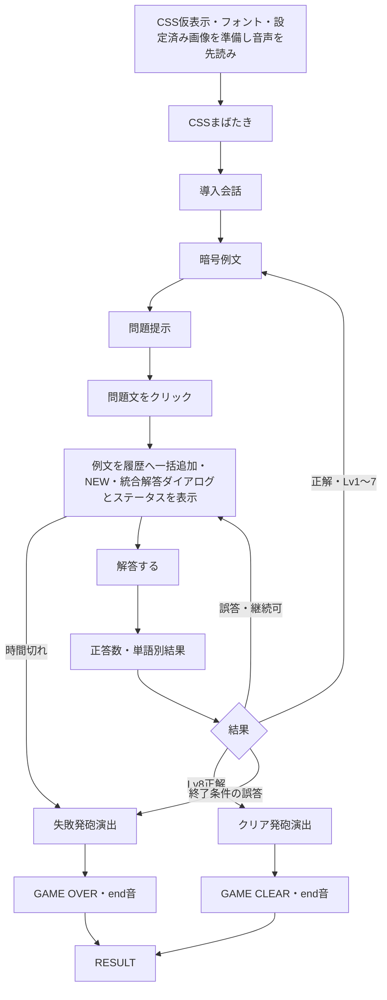

# テスト版完成に向けた変更仕様書

作成日: 2026-07-17
版: 1.0
対象: UI・絵担当、実装担当
最終決定: @ly(らい) / PM
最終更新: 2026-07-20
ステータス: 仕様承認済み・実装未完了
承認日: 2026-07-20

## 1. 位置付け

本書は、テスト版完成に向けたC01〜C07の変更を正式仕様として定義する。既存のゲームルール、Lv1〜Lv8、日本語語彙、誤答回数、時間切れの基本ルールは、明記した箇所以外変更しない。

- 暗号フォントは`mende-kikakui-font-guide.md`を正とする。
- 音は`sound-change-spec.md`を正とする。
- 本書の変更は`game-rule.md`、`ui-spec.md`、`implementation-spec.md`へ統合済みとする。
- 実装完了は本書の承認とは別に、受け入れ条件を満たした時点で判定する。

## 2. 承認済み変更

| ID | 変更 | 承認内容 | 状態 |
| --- | --- | --- | --- |
| C01 | NEWアニメーション | 下矢印とNEWを一体で上下移動 | 承認 |
| C02 | NEW既読 | 新着ごとに最初の手帳表示で既読 | 承認 |
| C03 | 手帳簡素化 | 提示例文・正答履歴専用とし、別タブと推理入力を削除 | 承認 |
| C04 | 暗号フォント | Mende Kikakuiの実Unicode文字を使用 | 承認 |
| C05 | 判定表示 | `正答 n / N`と単語別結果を表示 | 承認 |
| C06 | 開始まばたき | 画像ではなくCSSで実装 | 承認 |
| C07 | 終了タイトル | 発砲後に`GAME CLEAR`／`GAME OVER`を表示 | 承認 |

## 3. 変更後の全体フロー



## 4. NEW通知

### 表示

- 手帳位置を指す下矢印と`NEW`を一体の非クリックUIとして表示する。
- 問題文をクリックして解答受付へ入り、現在レベルの例文を一括追加した瞬間に表示する。
- 同じ瞬間に`write-note.mp3`を1回鳴らす。
- 黒または暗い灰色を基調に、くすんだ暗赤色を縁・影へ使う。

### アニメーション

| 項目 | 承認値 |
| --- | --- |
| 移動 | 基準位置から上下4px |
| 1往復 | 1800ms |
| 半周期 | 900ms |
| easing | `ease-in-out` |
| 繰り返し | 表示中は無限、交互再生 |
| 実装 | `transform: translateY()` |

`top`や`margin`をアニメーションさせない。`prefers-reduced-motion: reduce`では移動を止める。

### 既読

- NEW表示後、閉じた手帳を初めて開いた瞬間に既読へする。
- 同じレベルで手帳を閉じても再表示しない。
- 閉じる操作だけでは既読stateを変更しない。
- 次レベルで解答受付へ入り例文を追加した時は、新しい未読として扱う。
- リトライ時は既読stateを初期化する。

## 5. 手帳

### 最終仕様

- 男が提示した暗号例文と日本語訳に加え、正答した問題と解答を同じ表示形式で追加する。
- 現在レベルの例文は、問題文をクリックして解答受付へ入る時に一括追加する。
- 正答履歴は問題IDで重複を防ぎ、正答確定時に無通知で1件追加する。誤答と時間切れでは追加しない。
- 導入、例文、問題提示、判定中は開けず、解答受付中だけ操作できる。
- 見出しは`手帳`。
- 履歴を時系列順に6件ずつ固定分割し、左ページを3件まで埋めてから右ページを3件まで埋める。
- 解答受付中だけSpaceで開閉し、開いた直後は最新の見開きにする。
- A/Dで範囲内の前後の見開きへ移動する。
- 最初の見開きでA、最後の見開きでDを押しても移動しない。
- 履歴はレベルをまたいで保持し、正解後もリセットしない。
- 手帳内に閉じるボタンを置かない。
- Tabはゲーム操作に使わず、ブラウザ標準のフォーカス移動を維持する。
- Spaceで閉じた時に`close-note.mp3`を1回だけ鳴らす。
- 手帳を開いている間も解答タイマーを進め、0秒で手帳を閉じて失敗演出へ移行する。
- 正答履歴の追加ではNEW通知、未読state、`write-note.mp3`を変更しない。

### 存在しない機能

- 別メモ画面とタブ
- 暗号単語への日本語割り当て表
- 手帳内の中央候補リスト
- 手帳用の候補選択stateとcallback
- 閉じるボタンと閉じるcallback

## 6. Mende暗号フォント

### 表示方針

- `Noto Sans Mende Kikakui`をローカル配置し、`next/font/local`で読み込む。
- Web用は`src/assets/fonts/NotoSansMendeKikakui-Regular.woff2`、Figma用は同じソースのTTF/OTFを使う。
- `public/licenses/NotoSansMendeKikakui-OFL.txt`へライセンスを置く。
- 仮英字、Private Use Area、暗号画像は使わない。
- 通常会話、日本語訳、ボタン、リザルトへMendeフォントを適用しない。

### データ

```ts
export type CandidateIndex = 1 | 2;
export type CipherId = `${InternalCategory}-${CandidateIndex}`;

export type CipherGlyphEntry = {
  cipherId: CipherId;
  glyphText: string;
};
```

- カテゴリ6文字は`U+1E865`、`U+1E822`、`U+1E8A3`、`U+1E83D`、`U+1E845`、`U+1E83A`。
- 候補1は`U+1E854`、候補2は`U+1E827`。
- 1単語はカテゴリ文字と候補文字のコードポイント列。
- 正誤判定は`glyphText`ではなく、トークンID、`cipherId`、日本語正解データで行う。

### 文字方向

- 問題内の単語順は左から右。
- 各暗号単語の内部は右から左。
- 暗号文コンテナは`direction: ltr`、単語は`direction: rtl`と`unicode-bidi: isolate`を使う。
- 各単語へ`lang="men-Mend"`と`暗号単語1`のような`aria-label`を付ける。

### 読込失敗

- `fontStatus`を`loading`、`ready`、`error`で管理する。
- 実際のcomputed font-familyと必須8文字を`document.fonts.load()`で確認する。
- ビルド前にWOFF2のcmapを検査する。
- `ready`になるまで暗号を描画しない。
- `error`の場合は`暗号フォントを読み込めません`と再読み込み案内を表示し、解答を停止する。
- ローカルと`basePath`付き授業サーバでフォントURLがHTTP 200になることを確認する。

## 7. 判定フィードバック

### 表示内容

- `解答する`を押した時だけ判定する。
- `正答 n / N`を解答UI上部またはボタン付近に表示する。
- 各選択済み日本語を、正答は緑`#67c587`、誤答は赤`#c75b5b`で表示する。
- 色だけでなく、細い枠と`正答`／`誤答`ラベルを使う。
- 暗号文字の赤は変更しない。
- `aria-live="polite"`で正答数を通知する。

### 遷移

| 結果 | 1400ms後の動作 |
| --- | --- |
| 全問正答・Lv1〜7 | 次レベルの例文へ |
| 全問正答・Lv8 | クリア発砲演出へ |
| 誤答・継続可能 | 選択と判定を保持して解答へ |
| 誤答・終了条件 | 失敗発砲演出へ |

- 1400msの表示中はタイマーと解答操作を止める。
- 継続可能な誤答では、選択内容と判定結果を残す。
- 日本語を実際に変更した時点で判定結果を消す。
- 判定結果が残っている間は同じ解答を再送信できない。

## 8. 開始まばたき

### 制作と実装

- 暗転、半目、全開の画像差分と黒マスク画像を制作しない。
- 現行版は背景、人物、机、手帳、ペンをCSS仮表示し、上下の黒いレイヤーをCSSで動かす。
- レイヤー内側を楕円状にし、まぶたに見える曲線を作る。

### タイムライン

| 経過時間 | 視界 |
| --- | --- |
| 0〜300ms | 完全な暗転 |
| 300〜650ms | 細い隙間まで開く |
| 650〜820ms | 一度閉じる |
| 820〜1250ms | 半分程度まで開く |
| 1250〜1410ms | 短く閉じる |
| 1410〜2300ms | ゆっくり全開 |

- 将来画像パスを設定した場合は対象をクリティカル素材とする。現行の空配列では直ちに読込完了とする。
- 設定済み画像の読込失敗または5000ms超過時は、演出を始めずエラーを表示する。
- 最外要素の完了通知専用`animationend`で導入会話へ進む。
- 不達時は演出時間+250msのフォールバックを同じ一度きりの完了ガードへ接続する。
- 演出中は全ゲーム入力を無効にする。
- リトライ時も最初から再生する。
- モーション低減時は300msのフェードにする。

## 9. 発砲後の終了タイトル

### 共通フロー

1. 男が銃を抜き、`draw-gun.mp3`を鳴らす。
2. 終了種別に応じて銃を向ける。
3. 発砲し、`gun-shot.mp3`と最大100msのフラッシュを再生する。
4. 暗転する。
5. `endTitle`へ進み、`end.mp3`を1回だけ鳴らす。
6. `GAME CLEAR`または`GAME OVER`を表示する。
7. 完了後に1回だけリザルトへ進む。

`endedAt`はLv8の最終正解、終了条件となる誤答の送信時、または時間切れ確定時に未設定の場合だけ保存する。時間切れは`answerFeedback`を通らず、`mistakeCount`と誤答音を変更しない。判定表示、発砲、終了タイトルの時間を結果へ含めない。

### GAME OVER

- 暗い赤を使う。
- 衝撃表示と小さな横揺れを行う。
- 通常時は2300ms表示する。

### GAME CLEAR

- 象牙色と淡い金色を使う。
- 浮上、字間収束、淡い光を行う。
- 通常時は2400ms表示する。

### モーション低減

- 両タイトルとも1500msの単純なフェードにする。
- 完了通知と+250msフォールバックは同じ完了ガードを使う。

## 10. コンポーネント

```text
src/components/
  GameScreen.tsx
  DialogueBox.tsx
  ChoiceList.tsx
  CipherText.tsx
  Notebook.tsx
  TimerDisplay.tsx
  OpeningBlink.tsx
  CutsceneScreen.tsx
  EndTitleScreen.tsx
  ResultScreen.tsx
```

| コンポーネント | 変更後の責務 |
| --- | --- |
| `GameScreen` | 未読、判定、開始、発砲、終了タイトルの遷移 |
| `DialogueBox` | 通常会話、例文、問題単独提示の描画 |
| `ChoiceList` | 問題文、単語直下の解答枠、候補、操作案内、正答数、トークン別結果を統合して描画 |
| `CipherText` | Mende文字と方向、読み上げラベル |
| `Notebook` | 左右見開きの提示例文・正答履歴、NEWの描画だけ |
| `OpeningBlink` | CSSまばたきと完了通知 |
| `CutsceneScreen` | 発砲・暗転まで |
| `EndTitleScreen` | 終了タイトルと完了通知 |
| `ResultScreen` | 終了タイトル後の結果だけ |

## 11. 型とstate

```ts
export type GamePhase =
  | "opening"
  | "introDialogue"
  | "exampleDialogue"
  | "question"
  | "answering"
  | "answerFeedback"
  | "clearCutscene"
  | "gameOverCutscene"
  | "endTitle"
  | "result";

export type TokenJudgement = "correct" | "incorrect";

export type AnswerJudgement = {
  isCorrect: boolean;
  correctWordCount: number;
  totalWordCount: number;
  tokenResults: Record<string, TokenJudgement>;
};
```

追加・維持するstate:

- `isNotebookOpen`
- `notebookPage`
- `hasUnreadExamples`
- `answerJudgement`
- `fontStatus`
- `openingAssetStatus`
- `cutsceneStep`
- `resultStatus`
- `startedAt`、`endedAt`

別メモ、別モード、手帳用候補選択に関するstateは持たない。

## 12. 主要props

```ts
export type NotebookSpread = {
  left: ExampleRecord[];
  right: ExampleRecord[];
};

export type NotebookProps = {
  isOpen: boolean;
  spread: NotebookSpread;
  page: number;
  pageCount: number;
  newAnimationHalfCycleMs: number;
  showNew: boolean;
};

export type ChoiceListProps = {
  // 既存の解答props
  instruction: string;
  judgement: AnswerJudgement | null;
  disabled: boolean;
};

export type OpeningBlinkProps = {
  reducedMotion: boolean;
  onComplete: () => void;
};

export type EndTitleScreenProps = {
  status: ResultStatus;
  reducedMotion: boolean;
  onComplete: () => void;
};
```

## 13. 設定値

```ts
export const GAME_CONFIG = {
  finalLevel: 8,
  safeMistakeCount: 1,
  timeLimitSeconds: 90,
  warningTimeSeconds: 15,
  examplesPerNotebookSpread: 6,
  newAnimationHalfCycleMs: 900,
  answerFeedbackMs: 1400,
  openingBlinkMs: 2300,
  reducedMotionOpeningMs: 300,
  openingAssetTimeoutMs: 5000,
  animationFallbackBufferMs: 250,
  cutsceneStepMs: 1200,
  shotFlashMs: 100,
  gameOverTitleMs: 2300,
  gameClearTitleMs: 2400,
  reducedMotionEndTitleMs: 1500,
  openingAssetPaths: [] as readonly string[],
} as const;
```

90秒と15秒は変更可能な既定値。その他の値はテスト版の承認値とする。

## 14. UI制作物

### 必要

- NEW通知の静止デザイン。
- Mendeフォントを適用した2・3・5単語のフレーム。
- 判定前、正答、誤答、全問正答、一部正答の状態。
- `GAME OVER`と`GAME CLEAR`の文字組みと最終静止状態。
- 発砲直後の黒背景と終了タイトルの配置確認。

### 不要

- 手帳の別タブ、推理入力、中央候補リスト、閉じるボタン。
- 仮英字版、Private Use Area版、暗号画像。
- まばたき用画像、黒マスク画像。
- NEWの上下位置差分画像。
- 終了タイトル画像。

## 15. 担当と作業順

1. @ささかまぼこ。がNEW、手帳、判定、終了タイトル、Mende文字のUI差分を作成する。
2. @ほっそーが手帳簡素化、NEW、Mendeフォント、開始演出、終了タイトル、音を実装する。
3. @かまぼこ(本物)が正答数、単語別判定、判定後遷移を実装する。
4. @かまぼこ(本物)が`GameScreen`へ全機能を統合する。
5. @かまぼこ(本物)と@ほっそーがPCブラウザで通し確認する。
6. @ly(らい)が最終プレイを行い、実装完了を判定する。

同じ時間帯に複数人が`GameScreen.tsx`を大きく編集しない。削除作業と新規機能を可能な限り小さなPRへ分ける。

## 16. 承認値

| ID | 決定項目 | 承認値 | 状態 |
| --- | --- | --- | --- |
| D-C01 | NEW | 上下4px、1往復1800ms | 承認 |
| D-C02 | 手帳見出し | `手帳` | 承認 |
| D-C03 | 言語フォント | `Noto Sans Mende Kikakui` | 承認 |
| D-C04 | 配信・利用条件 | ローカル配置、OFL、Web/Figma同一ソース | 承認 |
| D-C05 | 暗号文字 | 承認済みの実Unicode 8文字 | 承認 |
| D-C06 | 判定色 | 緑`#67c587`、赤`#c75b5b` | 承認 |
| D-C07 | 判定表示 | 1400ms | 承認 |
| D-C08 | 誤答後 | 選択と判定を保持 | 承認 |
| D-C09 | まばたき | 合計2300ms | 承認 |
| D-C10 | GAME OVER | 衝撃と小さな横揺れ | 承認 |
| D-C11 | GAME CLEAR | 浮上、字間収束、淡い光 | 承認 |
| D-C12 | 発砲フラッシュ | 1回、最大100ms | 承認 |
| D-C13 | 経過時間の終了点 | 終了条件の判定または時間切れ確定時 | 承認 |
| D-C14 | リザルト見出し | `RESULT` | 承認 |
| D-C15 | 手帳1見開き | 左3件、右3件の順で固定配置 | 承認 |
| D-C16 | 時間切れ | 0になった瞬間に失敗演出へ移行 | 承認 |
| D-C17 | 音声応答 | 起動時に各音源3要素を先読み | 承認 |
| D-C18 | 手帳中の時間 | 手帳表示中も進行 | 承認 |
| D-C19 | 正答履歴 | 問題と解答を通常例文と同じ形式で無通知追加 | 承認 |
| D-C20 | 解答ダイアログ | 問題文、単語直下の解答枠、候補、判定、操作案内を1つの外枠へ統合 | 承認 |
| D-C21 | ステータス表示 | 解答中と判定中だけ表示し、判定中は値を維持して停止 | 承認 |

## 17. 受け入れ条件

- 問題文のクリック後に例文が一括追加されてNEWが表示され、最初に手帳を開くと消える。
- 手帳には提示例文と正答履歴があり、解答受付中だけSpaceとA/Dで操作できる。
- 履歴1〜18件が、各見開きの左3件、右3件、次の見開きの順に表示される。
- 正答時だけ問題と解答が重複なく追加され、その追加ではNEWと書き留め音が発生しない。
- 導入、例文、問題単独提示中は残り時間と間違い可能回数を表示せず、問題文クリック後に統合解答ダイアログと同時に表示される。
- 解答中と判定表示中は問題文が二重表示されず、各Mende単語の直下に対応する解答枠がある。
- 判定中も統合ダイアログとステータスを表示したまま、カウントと操作だけが止まる。
- Tabはゲーム内表示を変えず、標準フォーカス移動を行う。
- すべての暗号がMende文字で表示され、仮英字とPrivate Use Areaが露出しない。
- フォント読込失敗時に別表記でゲームを続行しない。
- `解答する`を押した時だけ正答数と単語別結果が表示される。
- 判定中はタイマーと操作が止まり、継続可能な誤答では選択が残る。
- 開始まばたきが画像なしで動作し、素材エラー時に無限待機しない。
- 発砲後に対応する終了タイトルと`end.mp3`が1回再生され、その後リザルトへ進む。
- Spaceで手帳を閉じた時だけ`close-note.mp3`が1回鳴る。
- Spaceで手帳を開いた時と、A/Dで見開きが移動した時だけ`open-note.mp3`が1回鳴る。
- 継続可能、2回目の各誤答で`wrong-answer.mp3`が1回だけ鳴り、時間切れと正解時には鳴らない。
- 時間切れ時は失敗回数を増やさず、判定表示なしで失敗演出へ進む。
- 手帳表示中もタイマーが進み、0秒になると手帳を閉じて失敗演出へ進む。
- 通常とモーション低減の両方で、完了callbackが1回だけ呼ばれる。
- 1920×1080とPCブラウザ内の縮小表示でレイアウトが成立する。
- ローカル、静的ビルド、`basePath`付き授業サーバで素材が取得できる。
- 開始、Lv1〜Lv8、誤答継続、ゲームオーバー、クリア、リトライを通せる。
